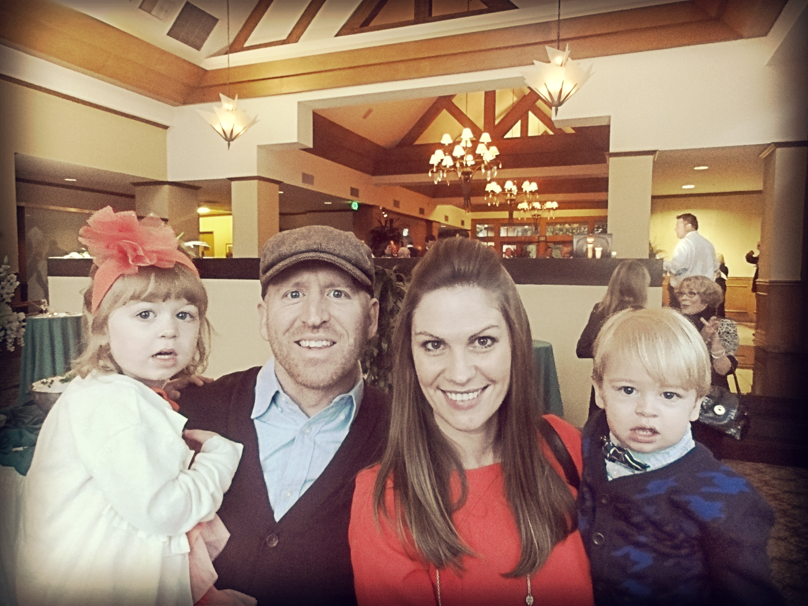

\[row\]\[col w="6"\]

# about

## THE DAD ISSUES

M y name is Bret Marshall Spears, a proud son of Kentucky. I was raised by a single mother, a saint who strove to protect me and my kid brother from the tragic consequences of a shattered home. I spent the better part of my 20’s in academic philosophy, both as a student and instructor. I’m a hoops junkie. I have an incurable case of wanderlust. And, for the last four years, I have been a stay-at-home-dad. I live in Tulsa, Oklahoma with these fine folks…\[/col\]\[col w="6"\]\[/col\]\[/row\]

\[hr ="20"\]

\[row\]\[col w="12"\]

### Mary

It is hard for me to believe that it has been over a decade since this Montana beauty “took the physical challenge” and hitched up her star with my own. A chronic over-achiever whose love for a well-executed spreadsheet is mildly disturbing, she is my favorite thing in the whole world. She relishes in making things beautiful. She has the work ethic of a Puritan coal miner and the looks of an Old Hollywood leading lady. Mary works as a director of accounting for a large energy company and is exceptional at what she does, in keeping with the myriad other capabilities that she possesses. She can bring home the bacon, cook it up, and chew the fat. I’m not entirely sure what that last part means…\[/col\]\[/row\]  
\[row\]\[col w="4"\]\[/col\] \[col w="8"\]

### Mary Grace (the Eldest)

Our eldest progeny, M.G. is a textbook extrovert who encounters each new face with a sense of possibility. She is naturally empathetic, immovably stubborn, and, I suspect, a little boy-crazy. She doesn’t like bugs, except for “ladybugs, butterflies, and grasshoppers”. If Vegas put out lines on the number of costume changes “Geezy” makes on a given day, they would hover around a baker’s dozen.\[/col\]\[/row\]  
\[row\]\[col w="4"\]\[/col\]\[col w="8"\]

### Rock Robert (the Middle)

Named after my grandfather (who gave me my name), he is a 4th generation title-holder. A spindly, toe- headed boy, Rocky walks and talks like he’s just a touch punch-drunk. To be honest, I was a little worried about him for a while; it turns out the boy’s a damn genius, especially with letters. His imagination grows more broad and bright with each passing week. Above all else, he is exceedingly tender-hearted.\[/col\]\[/row\]  
\[row\]\[col w="4"\]\[/col\]\[col w="8"\]

### Boston Marshall (the Baby)

The baby of the bunch, he came into the world just minutes after Shane Victorino smashed a three- run triple off the Green Monster, en route to the Red Sox winning their first World Series at Fenway Park in 95 years. Boston, like all other babies, is little more than a quasi-conscious slug- a slumberous, hand-sucking, smiley slug. I can’t wait to see who he becomes…\[/col\]\[/row\]  
\[row\]\[col w="12"\]

### Jannette (The Mother-in-Law, a.k.a. “Nana”)

I would be remiss to exclude her from our roster. She has been ever-present in the lives of the children, offering enormous care for them and continual support for us. Nana is a bonafide super-granny whose unwavering optimism and seemingly limitless enthusiasm bring genuine joy into the kids’ lives on a weekly basis. She sews, cooks, gardens, AND does yoga. Imagine “Rosie the Riveter”, only with an IPad …….. and on crack.\[/col\]\[/row\]

\[hr="20"\]

# The Concept

## **The Dad Issues is…** brought to you by the letter "C"

\[hr="20"\] \[row\]\[col w="6"\]

## Confession

The Dad Issues is, first and foremost, a **CONFESSION**. As such, it attempts to be candid and conversational about Life, specifically through the lens of marriage, parenting, and family life. If it’s real, we tell it.\[/col\]\[col w="6"\]

## Critique

The Dad Issues is a **CRITIQUE**, an attempt to dig a little deeper into the status quo and challenge our preconceived notions. We will explore general ideas like Love, Equality, and Power, as well as more “politically” charged topics like gender roles, the social construction of consciousness, identity-building, the effects of fatherlessness, and the like. We will also tinker with American models of parenting, romance, work-life balance, and happiness.\[/col\]\[/row\]

\[row\]\[col w="6"\]

## Conversation

The Dad Issues is a **CONVERSATION**. We are not intending to “say the last word”. We would be happy, however, to say the first word. The commentary from our readership and the ensuing dialogue is of far more importance to us than the initial post. Consequently…\[/col\]\[col w="6"\]

## Community

The Dad Issues is a **COMMUNITY**. It is an invitation to encounter other folks, like-minded or not, who are striving to better understand their experiences by being vulnerable to the voices of others.\[/col\]\[/row\]

\[row\]\[col w="6"\]

## Cause

The Dad Issues is a **CAUSE**. It is our sincere hope that this platform will foster a deeper level of awareness, understanding, and care (both at the individual and social level) in the lives of its readers. In addition, we hope to carry these conversations into forums that might benefit from their findings.\[/col\]\[/row\]
