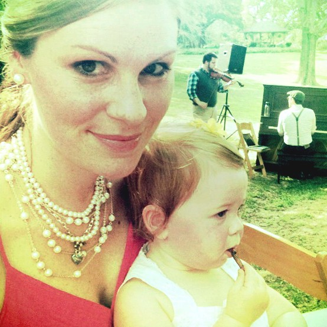

# Authors

## &

## Guests

\[hr gap=40\]

\[row\]\[col w="4"\]\[/col\]\[col w="8"\]

## Bret Spears

#### Author

Bret Spears is a proud son of Kentucky (the Bluegrass State) and a hoops junkie. He began his career in academic Philosophy, but has been a stay-at-home dad since 2010. When he's not catching a pickup game of basketball or changing a diaper, he's writing about parenthood and authentic personhood at www.thedadissues.com. He lives in Tulsa, Oklahoma with his wife, Mary, and their 3 small kids. \[/col\]\[/row\]

* * *

\[row\]\[col w="4"\]\[/col\]\[col w="8"\]

## Mary Spears

#### Author

Mary Spears is a working mom to three amazing kids and wife to Bret (he's amazing too). She delights in rap music, sweet dance moves, delicious food, and strong coffee. She occasionally can be talked into taking a break from her accounting world of spreadsheets to write a post for The Dad Issues.\[/col\]\[/row\]

* * *

\[row\]\[col w="4"\]\[/col\]\[col w="8"\]

## Eric Hall

#### Guest Author

Eric Hall is an Assistant Professor of Theology and Philosophy at Carroll College. When he's not busy teaching and writing, he's unequivocally trying too hard to reclaim his heritage as a Montanan (where his father was born) by boxing, wrestling, shooting, chopping wood, cooking for his family, and thinking up delightfully folkish colloquialisms for strangers who might accidentally set foot onto his property.\[/col\]\[/row\]

* * *

\[row\]\[col w="4"\]\[/col\]\[col w="8"\]

## Eric Hyde

#### Guest Author

Eric Hyde has undergraduate and masters degrees in theology from Oral Roberts University and a masters in Counseling Psychology from Northeastern State University. He attends St. Antony Orthodox Church in Tulsa, Oklahoma, where he lives with his wife and 2-year-old twins. He blogs at [ehyde.wordpress.com](http://www.ehyde.wordpress.com)\[/col\]\[/row\]
