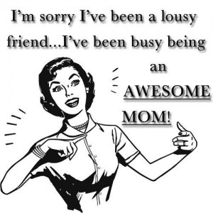

When I was a boy in rural Kentucky, "ecclesiocentric" activities like camp meetings, potlucks, and week-long revivals were never in short supply. You could get fat and happy on bread pudding and the Bread of Life in one sitting- often with the same results: indigestion and lethargy. There was one piece of advice that was nearly always given to fresh converts as a bit of pragmatic guidance for maintaining their new- found faith: "Quit hangin' around with your old crowd! They don't understand this New Life you've got now! Make new friends who share this same Life!"

Given what I've witnessed of our cultural landscape, the preacher could have just as easily been bellowing this practical wisdom to a church house full of novice parents and their newborns. Incidentally, both camps employ what has to be the worst recruitment strategy ever conceived: see to it that all new members alienate themselves from those upon whom they have direct influence and take up friendships with existing members only. Nothing inspires emulation and ardent fervor quite like being rejected.

It really is true: people with kids often turn into horrid friends. I don't think we mean to and, in many cases, I don't even think we're cognizant of the injuries being sustained by our people. Nevertheless, significant damage is done- both to the friend who is unwittingly ostracized and to the parent who unwittingly isolates himself. Here are some of the ways we fail our friends:

\[hr gap ="20"\]

**The Incessancy:**

Imagine if you had a friend who cared for her elderly father. You met the guy a few times and liked him well enough. He may have even seemed sweet. I mean, you didn't really know him at all and he was, at this stage in life, barely able to comprehend your presence in the room. Now imagine that the same friend won't shut the f\*ck up about her dad. She yaks on and on about the inane proclamations he makes, his attempts to keep regular bowel movements, maybe she even shows you some of the arts and crafts he's been doing. You can tell that she truly adores him and so much of her life is dedicated to his well-being. But, you keep thinking to yourself, "How do I tell her that I really don't care that much about her dad?! He's not _my_ dad, nor do I have all the inside information to contextualize the richness and depth that lay behind her heartfelt stories?" This is how our friends feel **all the time**. We bombard them with photos and anecdotes (most of which they have already seen on our Facebook page). And, if you're feeling sentimental- or if you're a little drunk- you'll make them look at all of the same photos again...

"Seriously, look at that face!"

"Um, yea I see it..."

"NO! SERIOUSLY LOOK AT THAT FACE!!!

"Um...."

I am undoubtedly guilty of this one.  One of my wife’s closest friends constantly mocks me for my incessant “Mary Grace stories”.  As a parent, you KNOW in your heart that no one really cares about your stories, but the internal force that drives you (in spite of the myriad of social cues telling you to start pumping the brakes) is a powerful one.  I’m not arguing that we should stop completely, but we need some balance.  When our time with friends is made up solely of these ramblings, the unconscious message we send is that **our** stuff is what matters. What about current events, ideas, art, comedy--hell, even gossip-- and God forbid **_their_** stuff?! We must learn to listen again, to find that wholesome cadence that reciprocity renders between souls.

\[hr gap = "20"\]

**The Assumption:**

The unconscious mindset that grounds the dominance of **_our_** story over our child-free friends is the fundamental belief that having a child is the **grown up thing** to do. Maturity and importance are uncritically attributed to our activity, over-and-against the "selfish" endeavors of our free-wheeling compatriots. It looks something like this:

I have written about this [here](http://www.thedadissues.com/kids-selfish/ "Not Having Kids is Selfish"), but it should be patently apparent that this is a poor way to think of anyone's pursuits, much less those of your closest confidants.  When we _do_ finally let our friends talk and conversation turns to their daily struggles or a situation at work that isn’t going their way, we often meet their grievance with condescension.  It goes something like this:

“Oh, you think you’re busy/stressed _now_, just wait until you have kids!”

This is unfair.  Imagine if every time you lodged a complaint about the loads of laundry piling up or the sick child you just attended to all day, a parent from yesteryear appeared and chastised you about how _**easy**_ you must have it since you now have washing machines to clean all that laundry and televisions to entertain your convalescent kiddo.  When you complete a 10 hour road trip with 3 kids and execute an end-zone dance so gratuitous that even Ochocinco would throw a flag– no one from the Oregon Trail suddenly appears and points out your air conditioning, rear entertainment system and lack of dysentery. \[lead\] Struggle and hardship is on a sliding scale.  Someone always has it worse. \[/lead\]

\[hr gap = "20"\]

**The Escape Hatch:**

We have all been there: you get to the end of a brutal day and your synapses are doing the Harlem Shake in your brain. You need a break. You get the go-ahead from HQ and start scrolling through your contact list.

Finally, someone agrees to meet your spit-up-stained, ragged ass out for a drink (knowing full well they're going to have to suffer through a Tumblr montage of your kid's cute mug). You are elated. Thank God you can get away for a minute and feel normal again. But, are we so dense that we miss how this translates to our rescuers?

"I'm desperate. Any warm body will do."

Whenever our engagement with our friends is predicated by where we’re **not** rather than where we **are**\- and with **whom**\- then we have fully violated the bond of brotherhood.. Ever had a friend that only calls when they need something? Yea, it's like that.

\[hr gap = "20"\]

**The Playground:**

Akin to the above sin against our comrades is the propensity to enter into their world like it's some kind of amusement park. I have a single friend whom I love dearly. On occasion I get the chance to really "tear it up" with him- go to his haunts, stay out later than usual, see what the cool kids are doing these days. And, shamefully (at times), I have looked so forward to the planned activity that I forgot to appreciate my host.  We all remember the kid in middle school we befriended because they had the best toys.  Don't do that to your friends.

\[hr gap = "20"\]

**The Un-vitation:**

I remember the first time I didn't get invited out with the group after we had kids. I found out a couple of days later about the poker game or karaoke or bar trivia or whatever it was. It rattled me. I already felt unlike myself because my normal ways of being had altered so rapidly; feeling excluded by my posse only served to exacerbate that sense. I mean, all of my friends were there together. How could one of them not call me? And then it dawned on me: if all of them were there and I had no clue about this gathering, that meant **_I hadn't reached out_** to any one of _them_ that week. As parents we are often quick to catalogue the times when we don't get invited **out**, but how many more instances pass where we neglect to invite our friends **in** to our "new" lives? In the midst of this monumental life transition, we become so focused on what we need _**from**_ **_them_** that we become blind to what they might need _**from us**_. As new parents, we incur trepidation and disorientation-and we expect grace and patience from our friends as we acclimate to these novel roles.  We presuppose that grace.  But, shouldn’t we also extend that graciousness back?  Might they also be experiencing timidity and confusion as to how our relationship might be changing? \[lead\]After all, we gained a child whenever we became parents.  To them, it may only seem as if they’ve lost a friend. \[/lead\]

My wife Mary and I try as much as possible to invite people in.  Mary likes to cook, so we try at least once a week to have **someone** over for dinner.  Sometimes it’s a group of single guys we lovingly call the “lost boys”.  Sometimes it’s a couple or a single friend that just hangs out.  We don’t try to keep the kids quiet or make our lives any different than they are.  We just invite our friends in… into the chaos, the thrown sippy cups and jokes that center around poop.  They read our kids bedtime stories or play a few games of hide and seek.  We fill their bellies and they refill our souls.  As a team, we get the kids to bed then break out the cribbage board.  We put on music, we talk--we all become as we used to be.

The philosopher Aristotle says that in order to foster an authentic friendship, you must “share the requisite amount of salt together”.  In our home, we pass it to the left…

#### \[hr gap 20\]  If you like this post, please share it on Facebook.  To make sure you never miss a post, like us on Facebook, follow us on Twitter or Instagram, or sign up for our Newsletter.  Thanks for reading. \[hr gap 20\]
