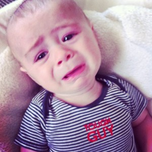
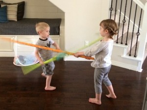
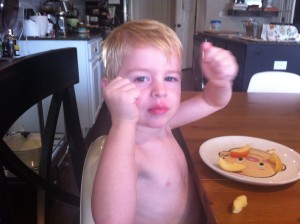
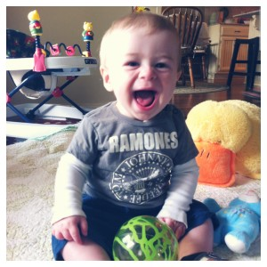
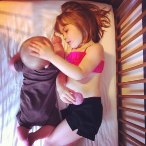

One of the unforeseen mutations of becoming a parent, for me, has been the exponential growth in jaw strength.  I clench my teeth a lot now. I never did that before.  Consequently, my bite force can deliver approximately the same PSI as a spotted hyena.  It’s a coping mechanism I suppose. . .

\[hr gap = "20"\]

I clench my teeth when baby Boston poops one minute **_after_** I put him in a clean diaper and one minute **_before_** we need to leave for church.

 

\[hr gap = "20"\]

I clench my teeth when I’ve called seven times for my two-year-old, Rocky, and he’s still lost in a fantasyland, not having budged from his spot.

\[hr gap = "20"\]

I clench my teeth when my four-year-old, Mary Grace, has asked the same question five times consecutively without once pausing for a response.

\[hr gap = "20"\]

I clench my teeth when I am simultaneously trying to hold the baby, cook breakfast, and referee a disagreement between Rocky and Mary Grace--and the dogs choose **that** moment to scratch at their bowl. Seriously, the odds alone are maddening.

\[hr gap = "20"\] I clench my teeth in worry **every. single. time** the kids run at full steam around the corner of the kitchen table, literally bracing myself for only potential impact- to their heads and my heart.

\[hr gap = "20"\]

I clench my teeth when I see them get hurt – not out of anger, but because of the anguish and the regret about what I might have done to prevent it, the seeming needlessness of their pain.

\[hr gap = "20"\]

I clench my teeth in pretend aggression when I roughhouse with the kids – to perfect a monster face or convince Rocky he’s a formidable foe.

 

\[hr gap = "20"\]I clench my teeth at the feel of baby Boston’s chunky leg in my hand when I hold him sidesaddle or when he flashes that face-shattering grin. The only appropriate word for cuteness of this intensity is “vexing”. I swear sometimes I just want to tear his leg off and put it in a stew.

\[hr gap = "20"\]I clench my teeth to choke back tears at the richness and joy that sucker punch my soul in the middle of random, family dance breaks.

\[hr gap = "20"\]I clench my teeth in those proud, ecstatic moments that pierce me to the core… when Rocky whispers “Dad, you’re best friend” or Mary Grace attends to the needs of another and I witness the first sprouts of empathy in her.

\[hr gap = "20"\]I often clench my teeth during hugs, when the magnitude of my love for them overwhelms my senses and I lose myself in the squeeze. I grind my molars to nubs that I might avoid grinding their bones to dust. **I cannot hold them as tightly as I would like.**

\[hr gap= "20"\] \[lead\] As a result of all this mandibular exercise, my face hurts a lot. Like a man who has eaten too well or laughed too heartily, or couldn’t stop smiling…\[/lead\]

#### \[hr gap 20\]  If you like _The Jaws of Life_, please share it on Facebook.  To make sure you never miss a post, like us on Facebook, follow us on Twitter or Instagram, or sign up for our Newsletter.  Thanks for reading. \[hr gap 20\]
