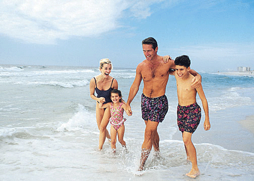
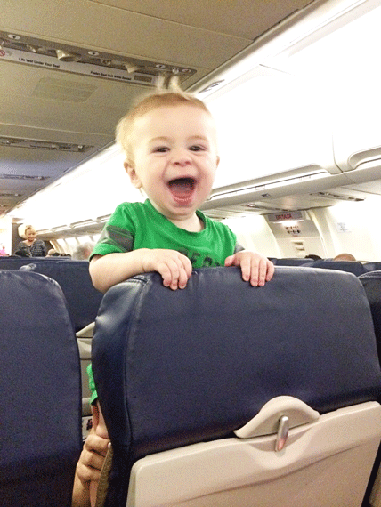
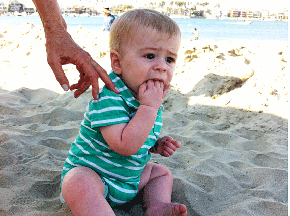
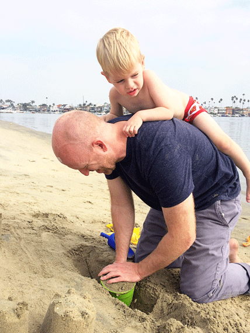
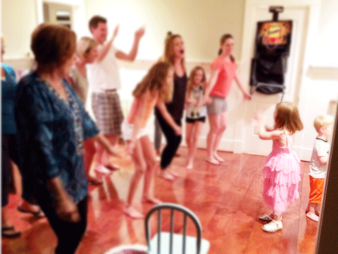

\[dropcap style="boxed"\]W\[/dropcap\]e recently returned from our first vacation as a family of five.   We went to California to stay at my Aunt’s beach house and spend some time with my extended family.  I spent many summers of my youth at the same house and was so excited to bring my little ones there.  Although it was wonderful and exhausting in all the right ways, it occurred to me that there were five distinct stages I experienced.  I present them to you.

\[hr gap = "20"\]

**Stage 1:  Excitement**

This stage began the moment I booked the plane tickets-which was months in advance.  During the months leading up to our family trip to the beach, I imagined long, idyllic family walks on the beach while the kids frolicked in the waves and Bret and I held hands.  Evenings would be spent sipping cocktails beachside, dreaming about the future while the kids slept peacefully inside--our heads in the clouds, toes in the sand.  We would build sandcastles as a family and we would laaaaauuugh--sometimes in slow motion--while we all looked at each other with knowing looks that said, “we’re building some magical memories here.”  This stage ended abruptly when packing for the trip began.

\[caption id="attachment\_847" align="aligncenter" width="504"\] We would look like these people!\[/caption\]

\[hr gap = "20"\]

**Stage 2:  Preparation and Survival**

This stage had its genesis as I took out the luggage and it began to sink in just HOW MUCH STUFF three kids under four would need for a week at the beach.  Once laundry was washed and our entire house was stuffed into a suitcase, we braved the gauntlet that is driving to the airport, loading three car seats, one stroller, and all our luggage onto the shuttle, checking in, and settling ourselves into the security line.  Going through security is like a well-choreographed waltz for Bret and me.  We are veteran travelers and put a premium on efficiency…

the three- and four-year-olds are ordered to stand still

jackets and shoes off; laptop, ipad, and liquids out

bags on belt

baby out of car seat

car seat on belt

stroller on belt

send big kids through security

carry baby through security

repeat the process in reverse on the other side

We nailed it.  Well, I’m sure we looked like a bunch of bumbling idiots, but we FELT like we nailed it.  The next five hours are spent keeping three kids happy on a plane while wishing that we were morally ok with just giving them sleeping pills.

\[hr gap = "20"\]

**Stage 3:  Doubt and Regret**

The first seed of doubt about the vacation planted itself the moment I wistfully rested our 9-month-old onto the sandy shore for his first time.  I don’t know what I expected from him – maybe for him to squeal with delight and start immediately building baby-sized sand castles.  What he DID is put a handful of sand directly into his mouth.  And then another. And then another. I’m surprised I didn’t find a pearl in his diaper…

In my daydreams about our romantic walks on the beach, I never thought about where the baby would be.  In reality, he’s in my arms attempting to swan dive **out** of my arms into that delicious sand.  Every. Single. Time.  Oh, and the older kids that would be running in and out of the surf laughing with glee?  They ran in and out, alright –but it was running in and out of the house 40 times a day.  This meant 40 times a day of hosing sand off their bodies while they shrieked and tried to get away from me.

When I planned an awesome family vacation at the beach, I forgot to account for the 2 hour time difference.  Although at home, our children wake up at the totally normal time of 8am, with the time difference, they are suddenly ready to rumble at 6am.  Vacation hours? Notsomuch.  Those nights on the beach sipping cocktails and dreaming?  We found ourselves too exhausted to do anything but collapse into bed.

\[hr gap = "20"\]

**Stage 4: Life-Long Memories**

The first couple of days were a little rough (see above).  It took a while for us to find our rhythm, but Bret and I quickly admitted to each other that we were a little overwhelmed and we formulated a plan.  We would take turns sleeping in, take turns getting some relaxation time on the beach sans kids, and generally protect each other's sanity.  Around the same time, my cousin and her kids returned to the beach after their own vacation away – boom! Instant playmates for the kids.  Just as quickly as I had witnessed my hopes and dreams for the vacation crumbling, everything turned around.

One blissful day, the baby slept in while me, Bret, and the big kids snuck out to the beach first thing in the morning.  While I sat on the beach with them and sipped my coffee, Bret and the kids built sandcastles and took turns burying my feet in the sand.  It was the stuff of dreams, I tell you.

In the midst of the chaos, great meaning came.  One night after dinner, Mary Grace was leading the whole family in a choreographed “dance” and the moment nearly crushed my soul with its intensity and richness.

The relationships that blossomed between our kids and my extended family were enough to warrant ten times the “trouble” of a family vacation.  \[lead\]Lifelong memories are not made without effort and maybe that’s as it should be. \[/lead\]

\[hr gap = "20"\]

**Stage 5: Re-entry**

We packed and traveled and did it all again going east this time.  We pulled up to our house after a full day of travel.  We paused.  The kids had fallen asleep in the back.  Getting out of the car meant that vacation was over.  School would start in two days and it would be back to real life.  Bret and I looked at each other and he whispered, “I don’t want to be home yet”.  “Me neither, babe.”  We took a deep breath in unison and opened the doors…

\[hr gap = "20"\]

What about you-- any triumphs or tribulations of vacationing with kids to share?  We'd love to hear about it in the comments section below. Thanks for reading!
