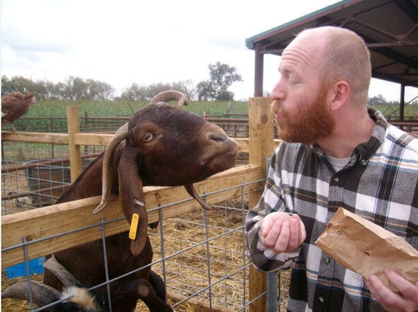

_A couple of quick notes:  We did a site update over the weekend and lost about 30 comments in the process.  We're in the thick of trying to restore them, but we're very sorry if your comment (and the response!) is not showing up on the site.  Secondly, just a quick note of thanks for reading and sharing the posts.  The "10 things" post has now been published in Germany, France, Belgium, Canada, and Australia --and on multiple US sites.  Just trying to keep up with and respond to comments on the various sites has taken a lot of time, so we're a bit behind the normal posting schedule (we try to have new content on Tuesdays and Thursdays).  As always, thanks for reading! - Bret and Mary_

\[hr gap = "20"\]

\[dropcap style= "boxed"\]P\[/dropcap\]oor baby Boston has inherited one of my most unfortunate traits: he over-writes his blog posts. Don't laugh! No, fortunately it's not that serious. Regrettably, he has been bequeathed my trick gut. The "spit up" phase of infancy (already a gnarly enterprise) was especially messy. Once he stopped nursing we bounced around, trying to find a food source that he wouldn't so readily regurgitate: powder formula (both regular strength and sensitive versions), and good 'ol cream of the cow. That last one seemed to agree with him **except** for the fact that he was allergic to it, extending the ever-proliferating list of items that will turn his skin leperous and crocodilian. It was getting frustrating and we needed a solution, pronto...

... and that's when we decided to give goat milk a whirl.  He's nearing his first birthday and someone had suggested it as an alternative.  I immediately threw my support behind the experiment, because I think goats are **bad ass!** We had a few on my grandma's farm growing up and I was fascinated by them. I can remember watching slack-jawed as one Billy nuzzled around in the garbage and extracted an aluminum can... which he then proceeded to devour! The milk of an animal with such a stomach was exactly what my boy needed. And, secretly, I wished that it might somehow transfer some of the goat's superpowers to Boston or, at least, that he might utter his first words with the hilarious bleating of Jim Breuer's "Goatboy". So far, no dice. **But**, the goat milk works! The boy loves it, his digestion is regulated, and his complexion has cleared up swimmingly. Hooray for the Meyenberg family and their ultra gentle, super-power-bestowing milk!

\[caption id="attachment\_900" align="aligncenter" width="621"\] The Goat Baby--he's probably trying to eat the camera.\[/caption\]

There is, however, one minor drawback: Boston almost always smells like a goat. Whenever he finishes a bottle, burps, passes gas, or on the increasingly rare occasions when he does spit up, he exudes that earthy, sweet n' sour funk that is indicative of good cheese and bad athlete's foot. He stinks. He smells like he spends his days at an early childhood Sherpa training center. Personally, I love it. Too bad for me, not everyone shares my affinity for the omnivorous beast. They're not crazy about goats, either ;)

As we've begun to get raised eyebrows and flared nostrils from childcare workers and casual acquaintances, it set me to thinking about how we derive judgments from what's wafting our way. When it comes to an opinion, the nose have it. And that got me to reminiscing about Sarge...

\[hr gap="20"\]

My grandmother was the administrator of a nursing home in small-town Kentucky for about 25 years. I spent countless days there as a lad- some of them not so glorious- like the time I put on a "concert" for the residents comprised mostly of my favorite Christian pop tunes. Yeesh. You'd probably **rather** hear a goat yodel. Or you could just put on a Fleetwood Mac album. Anyhoo, the majority of my time there was very rich and definitely formative. I would play checkers with Mr. Thames, who had lost his speech function in an automobile accident years before. We communicated through ball caps and kings, whittling away hours in silent understanding. I would sit with the old folks at Bingo night and help them keep track of their cards. There are a thousand fond memories from that place (not the least of which was sneaking into the kitchen to pilfer a scoop of Neapolitan or the 25c pickle at the market on the corner), but my absolute favorite thing was going to see Sarge.

Leona Sargent is one of the classiest human beings I have ever met. She was affable and quick-witted, with a countenance that conveyed a rare combination of worldly wisdom and genuine cheer. My grandmother introduced us and we became fast friends. We'd play gin rummy on the tray that hovered over her bed or she'd play a couple songs on her harmonica. She'd tell me stories from her long stretch of life as I sat astride her bed, munching on a butterscotch. She lived to be 105 and passed away in that same room that I had so often run to in my youth.

Just a few years later, I returned to that small Kentucky town to bury my own grandmother. We stopped by the nursing home to commiserate with old friends, but something was markedly different...

The place smelled funny. I do not know if it was innocence lost or the development of mature olfactory function, but there was an off-putting aroma in the air. I was squeamish. My mind jogged back to my days with Sarge and all of the heart that my grandma had poured out there. Why had I not noticed it back then? I stopped myself and took a deep breath, this time only taking in what was permanent- the memories of good souls now gone and the marks they left on my own.

\[hr gap = "20"\]

\[lead\]Sometimes in life, if you stop at the first pungent whiff of a person- if your charity isn't stronger than the stench- you'll never sniff out the real essence of who they truly are.\[/lead\]

... And that gets me back to goat baby. It will happen that upturned noses will cast criticisms on us for letting him smell like a hoof. But, that's all right.

\[caption id="attachment\_901" align="aligncenter" width="601"\] I've slowly been building an immunity over the years\[/caption\]

Sometimes the most loving, healthy thing you can do as a parent is to let your kid stink...

... at that sport you don't see **any** natural talent for, but they so desperately want to play.

.... on bath nights, when the water is just too foreboding and their huge imaginations get the best of their tiny hearts.

... in all ways where the **perception** of who they are does a disservice to **the beautiful truth** of who they are.

Let 'em stink.

If nothing else, it will serve to ward off those who aren't willing to push past the apparent. Real care and friendship doesn't mind getting smelly. Ask any weekend warrior whose wife has accepted his sweaty hug, any roughneck come home from the fields to be embraced by his children, any woman with her feet propped up in the lap of her sweetheart at the end of a long day...

Love stinks.
