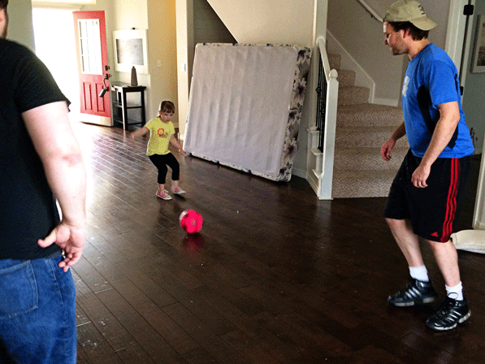
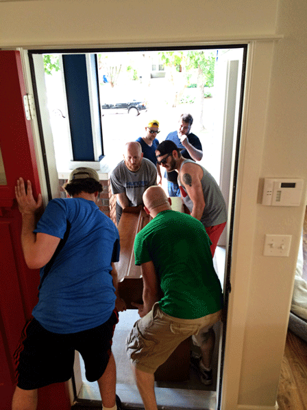
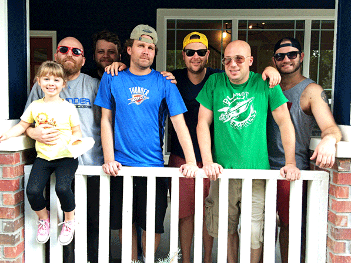
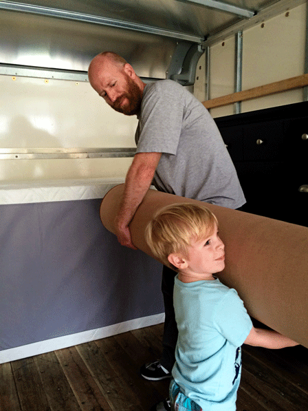
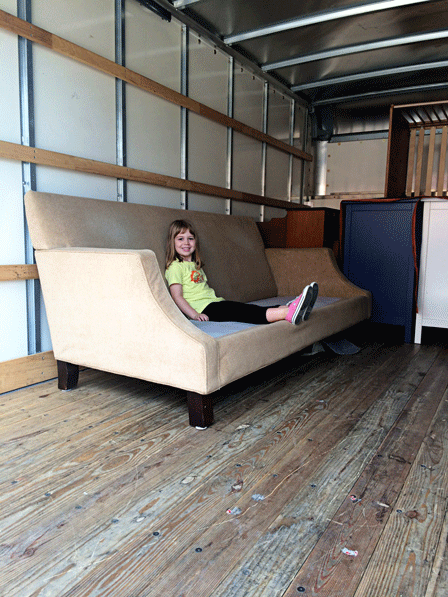
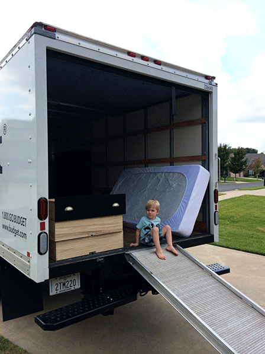
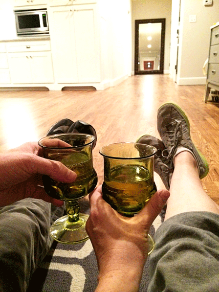

In philosophical discourse, there is a perennial question about the possibility of a genuinely altruistic act- whether or not humans are capable of behaving in a purely self-sacrificial manner. To any thinker who has answered to the negative, I'd like to present a counterfactual: friends helping you move. In my estimation, it is the paragon of altruism in the modern world. All of the normal desserts are off the table. Seriously. You can put on a sticker when you vote and puff out your chest; drain your veins at the blood bank and folks will nod with approval. But, tell someone that you spent your weekend painstakingly schlepping another person's shit into a cattlecar on wheels and they'll look at you like you're the biggest sucker on the planet. Fortunately for us, the company we keep is an enclave of saints who care little for titles. We owe them a great deal of gratitude. And free beer. Here is a glimpse of what our real lives have been for the past couple weeks:

Also, we just got internet after a 6 day stint without it (or tv) in the new house.  Hallelujah!

     

