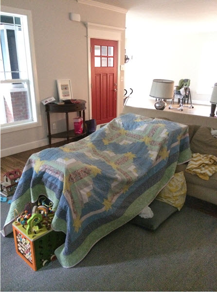

Being a stay-at-home dad, I have man-danced a time or two with insecurities about (not) making that sweet coin. Stacking paper. Procuring pork products and delivering them to my domicile. Um, money. Blah, blah, blah about being a man and the cultural expectations about "wearing pants". Personally, I hate wearing pants. And, even if I did wear pants in this hypothetical, fiscal haberdashery, they would inevitably be sweats.

It all comes down to feeling significant, I suppose, and whether we like it or not the Almighty Dollar gets its two cents in almost every time. I'm not saying that it should, but the fact that I feel the need to say so is a clear sign that it does. Becoming aware of our thoughts (whether conscious, sub- or un-) about exactly how we value our station in life is a great first step toward shoring up an identity that isn't slave to the status quo. So first, become aware. Next, make up ingenious quantifying apparatus to replace the nagging dissatisfaction with aforementioned healthy perspective ;). Such as this, perhaps:

\[hr gap = "20"\]

**The At-Home-Parent Replacement Equivalency Chart:**

Standard hourly childcare: $10/hr General housekeeping: $25/hr Private tutor: $40/hr In-house chef: $60/hr HAZMAT waste removal engineer: Priceless? Exorcist: $xx Child therapist: $150/hr Home finance consultant: $100/hr Private shopper: $30/hr Pet care and grooming: $35/hr Taxi service: in competition over rates with uber Home nurse care: $45/hr Nutritionist: $70/hr Internet police: $xx Spiritual advisor/Life coach: $100/hr Hairdresser: I shouldn’t actually be paid for my “skills” Amateur plumber: $50/hr Conflict resolution expert: Seriously, the FBI should hire me. Lifeguard (CPR and First Aid): Social chairperson: volunteer basis Birthday clown: tips Fort construction specialist: unknown

\[caption id="attachment\_951" align="aligncenter" width="446"\] Our living room fortress\[/caption\]

Etc. etc. etc.

You get the idea. Given that a stay-at-home-parent often performs several of these duties and given that there aren't any official weekends, **I have (in a super scientific manner) estimated their average replacement value at $17,348.26 a week.** Conservatively.

\[caption id="attachment\_952" align="aligncenter" width="446"\] Mary Grace grows impatient with my inability to braid- also, check out my fancy outfit!\[/caption\]

\[hr gap = "20"\]The other day the Social Security Department did me a solid and delivered a second-class existential crisis on my doorstep in the form of a **lifetime earnings summary**. Seeing my fair market value reduced nearly down to zero was a punch in the gut. I reeled for a bit. Not to worry, though.

I just opened up my handy dandy equivalency chart and took solace in remembering that my kids don't give a damn about any of it- neither the imaginary numbers the Machine withholds, nor the pretend valuations that I ascribe. **They used the Social Security document as a coloring page.**

\[hr gap = "20"\]

#### If you like _What an At-Home Parent is Really Worth_, please share it using one of the buttons below.  Be sure to follow us on Facebook or Twitter--or sign up for our newsletter. Thanks for reading!
