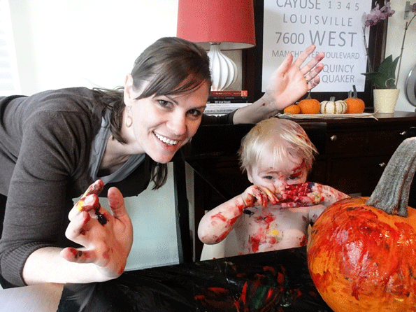
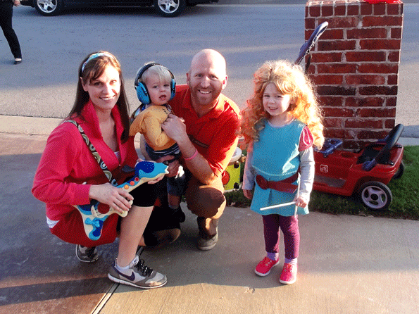
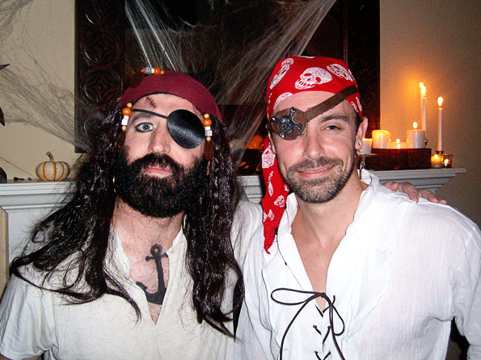
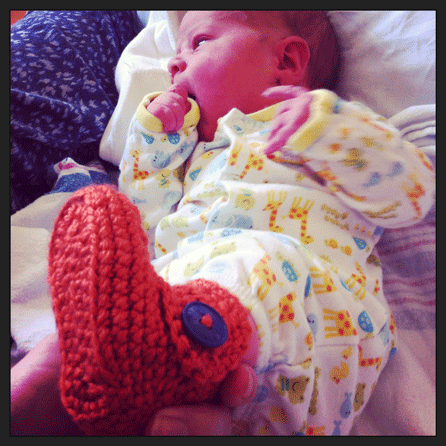

The picture above (from 2012) pretty much sums up why I stay off Pinterest.

Me (before starting the craft): "A toddler pumpkin painting party? Oh, that sounds like a lovely idea! The children will simply paint delicately with their fingers over a letter that I've attached to a pumpkin- we'll remove said letter, and voila--a perfectly painted pumpkin with their initial on the front. Could this BE any easier or more delightful?"

Flash forward to during the craft where I realize we've basically only successfully recreated a scene from Dexter.

\[caption id="attachment\_958" align="aligncenter" width="595"\] Look- I'm foolishly still smiling!\[/caption\]

I think about this doomed-from-the-start craft just about every time Halloween rolls around :)

\[hr gap = "20"\]

Since Halloween is upon us, I thought I'd round up a few of our favorites.

**2012-** When the kids were obsessed with the Fresh Beat Band and we of course had to be them for Halloween. Just looking at this picture makes me instinctively start singing the theme song. Get the beat!

\[caption id="attachment\_963" align="aligncenter" width="595"\] The Fresh Beat Band!\[/caption\]

**2010:** When Bret was the most realistic pirate ever and a baby Mary Grace was thoroughly confused. Aargh!

**2013**: In the hospital with newborn Boston. He will likely forever be having Halloween-themed birthday parties.

This year, Mary Grace and Rock have changed their minds a few times for what they want to be for Halloween. This has been the progression so far:

MG: Rapunzel; Rock: Super Why

MG: Anna (from Frozen); Rock: Super Why

MG: a witch; Rock: her scary black cat

MG: a bunny rabbit; Rock: still holding strong at "scary black cat"
