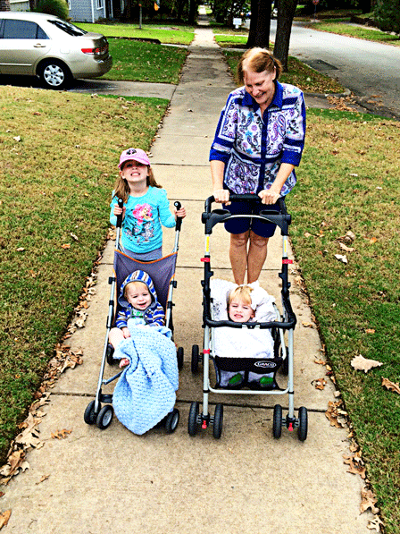

The other day Nana and I bundled up the whole crew and set out for an afternoon walk through the neighborhood. As we strolled along, we began to coax Mary Grace about the spectrum of colors to be found in the sloughing crowns of Autumn. "Look at THIS one!" "What does THIS one look like?" "Ooh, look at THAT yellow one!" She was quickly enthralled by it. Discontent with merely admiring the foliage, she began to search for leaves of all different colors and shapes, assembling a collection that began to pile up on her slumbering brother.

\[caption width="448" id="attachment\_977" align="aligncenter"\] The crew ready for a stroll\[/caption\]\[caption width="448" id="attachment\_976" align="aligncenter"\] We pile our leaf collection on a sleeping Rocky\[/caption\]

It really was spectacular. Aubergine and amethyst; magenta and indigo; goldenrod and hazel; even the verdant green of revolutionaries still clinging to summer's promise. We all got into the act, scouring the landscape for new tones and painstakingly selecting each contribution for our cache. When we got home, MG and I sat up at the bar and sorted our Fallen soldiers into rank and file, like unto like. Purples go here. Reds go there. We tinkered with the progression from dark to light, demonstrating to her how purple bleeds out its blue to yield red- how red then passes away, leaving vestiges of itself in orange along the way to yellow. Her eyes danced as the discards from Maple and Magnolia blossomed one last time into an autumnal kaleidoscope. In the middle of it all, a thought began to tease the back of my mind:

"These are the colors of their dying."

As the winter draws near, the long darkness takes its toll on the leaves. The sunlight necessary for their vitality is curtailed and the photosynthetic effect slows to a crawl. Capillaries contract in the growing cold, while the lifeblood of the leaf stalls sluggishly in its veins. So, moribund and glorious, they tinge the sky with their passing...

The blue-black is bruising, The mustard is jaundice, The crimson of bloodshed, The unworldly purple of a choke, Trauma in tangerine,

They die with resplendence. Unwittingly, we had crafted a cardboard mausoleum for Mother Nature.

 

\[hr gap = "20"\]

Our children are as the leaves. They flourish and fade in season. Newborn. Infant. Toddler. Pre-K . Tween. Teen. And all the stages in between. Their innocence. Their dependence. Their ignorance. Their affection. **It all burns bright and gives way to newness.** We see them anew, lamenting the loss of a season gone by yet enamored by the brilliance of their passage.

Just as Mary Grace paused at the crosswalk as we collected leaves and proceeded to pass over unaccompanied. She was mighty proud. A part of me died in that moment. And, although she doesn't know it, a part of her fell to the ground as well. A shade of her that will never turn again...

And, we are all as the children. We begin to die on the day of our birth, the machinations whirring into primacy then steadily descending into decline. \[lead\]We crescendo with all the vibrance of sunburst and sage, only then to need again the sleep of winter's grey relief. Each choice. Every season. We die with them all.\[/lead\]

The philosophers of old used to talk of the "beautiful death". La Bella Morte. Freedom, dignity, courage, and resolve were the hallmarks of this way. Interestingly, they are also the defining features of a beautiful Life. They are inextricably intertwined.

**\[lead\]We are all dying. Live colorfully.**\[/lead\]
