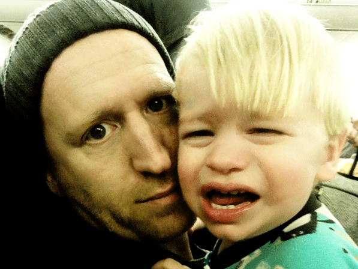

In one of the oldest legends surrounding the Buddha, young Siddhartha makes his maiden voyage outside of the palace walls and the prince is met with a sequence of encounters- commonly called the “Four Passing Sights”- that would forever alter his destiny, not to mention the history of world religion. As the story goes, a prophecy at his birth foretold a two-fold, choose-your-own-story path: stay in the palace to become magnificent royalty or go out into the world and become a holy man of wisdom. His father, desirous that his son would achieve the former end, sequestered Sid in the palace and surrounded him with all the delights of wealth and power. Apparently, even prefects aren’t perfect parents. Wordplay!! The plan worked up until his late 20’s, when he finally persuaded his father to let him go out into the city and witness the common life. Accompanied by his horseman, Siddhartha came upon a triptych of visions that shattered his naivety and inspired a deep concern for suffering:

An old man…

A sick man…

A dead man…

Reeling from a heavy dose of the real world (not the MTV kind, although I’m sure it has induced its fair share of existential crises), the Buddha-to-be began his quest for enlightenment and the solution to human suffering. He divested himself of his royal lineage, left the palace, and undertook the ascetic life of a monk.

Insight is like this sometimes. Not really what you see, but the timing of it all that evokes an emotion or epiphany well beyond the immediate picture. In about a 90-day span last year, I had my own series of “passing sights” concerning the nature of parental care and our judgments of it, particularly in the open marketplace. It really did feel like Somebody was trying to teach me something. Unfortunately for me, I played the role of the villain in each diorama. I’d like to think that Ben Kingsley would play me, if ever these shorts were cast. It’d probably just be Jason Statham, though.

\[hr gap="20\]

**Sight #1: Excessive force**

Mary Grace and I were headed out for a little QT one afternoon, headed to the mall to ride the carousel and score some sour peach rings. As we pulled down the ramp at our exit, her gentle chatter immediately gave way to raving hysteria as a lone mosquito came out of his hiding and rested alight the window pane next to her car seat.

“daddy, Daddy, DAddy, DADdy, DADDy, DADDY, DADDY!!!…”

Her panic grew with each second as giant tears began to fall down her face

“What is it? What is IT? What IS IT? WHAT IS IT?!” (I said in a very calm, composed, yet appropriately- ascending tone of concern)

I flew into action, overwhelmed by the instinct to protect and stricken by the intensity of her emotion. I put the car in park at the stop at the bottom of the exit, unbuckled, and half-turned into the back seat to righteously dispatch this Satanic pestilence come to trouble my little girl. My right hand flew, swift and strong, from the front seat and landed blow after blow to the car door and window, with Mary Grace flailing and writhing all the while, half from fright of the skeeter and half to avoid my wheelhouse (which was a bit wild due to my peeking to see if the light was green yet). Finally, all was still. That sucker was history and MG had even started to believe it. I buckled up and put the car in gear just in time for the light to turn (this detail should really impress you). I had been heroic. Not because I bested a bug, but because I had responded to my child’s false fear with real empathy. As we made the turn into the main drag, the SUV behind me sped up quickly and pulled into the lane astride us. The woman driving looked at me with demonstrative anger, even disdain, in her face. Initially, I was befuddled by her antics but then I thought about what that whole scene must have looked like from her perspective:

A car put into park on the highway, with a crazed man bellowing inside and repeatedly striking out in the direction of his 2-year-old daughter, who is ducking and sprawling as she bawls her eyes out….

\[hr gap="20"\]

**Sight #2: Stranger danger**

I have a close friend named Darrell who my daughter simply adores. When he comes into town, no one else exists. Just after her 3rd birthday, I made the mistake of telling her that he was going to be playing a concert in his home state of Wisconsin and that I planned to attend. She immediately requested to be my “plus one”. I declined, explaining that it was a long, long, long way away. She didn’t so much as flinch. She asked every single day, multiple times. She got it set in her mind that she would go to “Wikontsints”, go to Darrell’s concert, and “dance on the slage (stage)”. So, when the time came, we packed up the car together and set out to brave the 850-mile trek that lay ahead of us, leaving in the afternoon in hopes that she might sleep for the second half of the trip.

\[caption id="attachment\_1001" align="aligncenter" width="600"\] MG realizing her on-stage -with-the-band dream\[/caption\]

Sometime after midnight I pulled the car over to get some gas. She awoke in the process. We still had a few hours left on our trip, so I thought we probably ought to use the facilities. So, here we go…

Her, a drowsy and disoriented 3-year-old, sporting a pink Cinderalla pajama suit…

Me, a bedraggled and bleary-eyed scrub, draped in flannel with an untamed beard…

Us, together, walking into a truck stop in the middle-of-nowhere Iowa… at 2 o’clock in the morning.

We walked through the door and made a beeline to the bathroom. The men’s bathroom, no less. We crammed ourselves in the stall together and she set to doing her business. When she stood up I noticed that the elastic band from her underwear was digging a pretty good mark into the tops of her legs, probably worsened by the long car ride. I took ahold of the first leg and gave the elastic a little pull. The hold loosened from her leg nicely and I started on leg #2. Except, this time, instead of the elastic busting ever-so-slightly to allow a bit more room, there was a giant “RIPPPP!” that resounded in the stall as the entire side of my toddler’s underwear tore in two. To my unspeakable horror, my daughter looked up at me in shock- her face already contorted with sorrow- and loudly inquired, “WHY did you tear up my panties?!” I can only imagine how this might have sounded to a casual bystander.

\[hr gap="20"\]

**Sight #3: Rebel without a cause**

Rocky fell backward off the ottoman. I had begged him to get down. He was about 18-months-old when it happened. He took one-too-many steps in reverse and crashed right onto the back of his head. I held him as he struggled to regain his breath, undone by the pain and panic. And then he vomited. And then he vomited again. And then there was nothing left, but he heaved and shuddered anyway. Let me tell you something: watching an infant wretch is the closest thing I have ever seen to an exorcism. Because they can’t understand what’s happening to them (nor anticipate its onset), they experience visible terror with each lurch. The suddenness of the physical episode is drastically compounded by the psychological confusion, and it is stultifying. My son clung to me tightly, but you could see him begin to fade. Head wound, nausea, drowsiness- all classic signs of a concussion.

I whisked Rocky to the car, Marys #1 and #2 staying behind until help could come and mom could join us at the hospital. As he slinked into his infant seat, a thought rushed into my head: “Don’t let ‘em fall asleep!” Having had a few head injuries in my time, I knew this to be one of the cardinal rules. And, he WAS going to fall asleep in that chair. I pulled him out, he buried his head into my chest, and we clicked into the front seat together. I bolted out of the drive and hurried toward the emergency room. It was a short drive, but as we rushed along, I noticed him get heavier and become more still. He was falling asleep sitting up! I grabbed my phone from the dash and opened up Youtube to some old Donald Duck cartoons that I always kept in the queue. “Look at the cartoons, buddy” He came to a bit. He wouldn’t let go of my shirt, so I was forced to hold the phone at his eye-level with the hand that held him fast, operating the vehicle with the other. Here is a sample list of legal violations that I would have incurred at that moment:

Reckless endangerment

Speeding

Inattentive driving

Child safety seat violation

Gross negligence

Minutes later I, that same maniac whose hands had shunned 10 & 2 with such seeming blithe, would have my hands tremble together with my son’s as I watched the boy slip into a spinning metal abyss, softly singing the “Itsy Bitsy Spider” until the CT scan came to a stop.

\[hr gap="20"\]

\[lead\]It’s hard to know what you’re looking at sometimes. Real love often seems like a monstrosity.

Like the cries of a toddler being pricked by a needle or the "I hate yous" of a teenager grounded to her room...\[/lead\]

\[hr gap="20"\]

#### **What's your looks-are-deceiving "bad parenting" moment?  We'd love to hear about it in the comments section below.**
