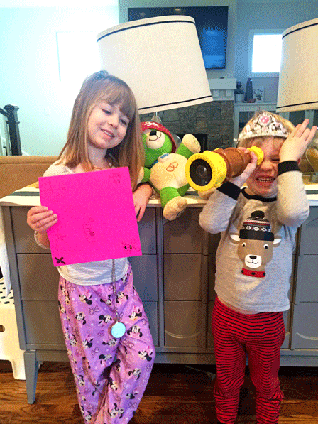
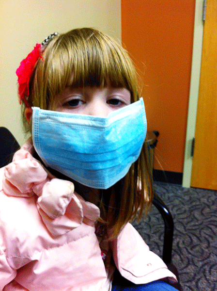

It's 4:30 am. I'm up doing dishes and listening to Survivor through my headphones. No, not the Destiny's Child hit single- the 80's power ballad machine most well-known for their work on the "Rocky" soundtrack, of course. Why, you ask? I have an indelible soft spot for underdogs. .. Oh, you mean about being up at this ungodly hour? Everyone at my house has the flu, except me. In point of fact, there are two strains of influenza roaming the halls of my home these days. The kids have all tested positive for influenza type A, a little gift Mary Grace brought home from school and then graciously shared with her brothers. Two days ago Mary started feeling a bit off and went to be tested, only to find out that she had contracted influenza type B at work. So, in theory, the kids are contagious to Mary (and me) with their "A" and mom is a threat to the kids (and me) with her "B". As a result, we're all cooped up in the house together, for the good of all mankind, wearing masks and keeping each other at arms length like a colony of hypochondriac lepers. I don't even wanna know what kind of viral cocktail is being distilled by my immune system as we speak- they'll have to utilize some esoteric, Greek letter to describe it, something like "Influenza Omicron". I mean, there's no way I'm making it out unscathed, right? I spend all day taking care of three A's and then share a bed with a B. I'm screwed.

\[caption id="attachment\_1077" align="aligncenter" width="448"\] My flu pirates with their treasure map. Day 4 of being cooped up.\[/caption\]

\[hr gap="20"\]

So far, though, I haven't experienced any of the normal ailments. You know the familia roster:

Coughing Fever Body aches Sore throat Chest congestion Runny nose Fatigue Nausea

\[caption id="attachment\_1078" align="aligncenter" width="448"\] Patient "Zero"\[/caption\]

\[hr gap="20"\]

HOWEVER, I have become convinced there is an alternate set of symptoms! If you should find yourself and/or your family suddenly bitten by the flu bug, watch out for these tell-tale signs:

Worry Boredom A sense of impending doom Heightened irritability Squalor An impaired sense of Time Intense worry Temporary insanity Dryness of the hands Hapless, phrenetic bursts of energy.. ... followed, without notice, by a full-on crash. Stress-eating Exhausting, exasperating, heart-wrenching worry

These, these I think we have all been stricken with a time or two over the last week.

\[hr gap="20"\]

There's a reason they make you swear your Love will remain steadfast "... in sickness". Being sick sucks. And, being around people who are sick- well, that ain't no picnic either. Whether as the infirm or as those caring for them, there exists the opportunity to visit the greatest climbs of our meekness and compassion or ... have the thin veneer of work-a-day niceties horrifically unmasked to expose a callous and cruelty worthy of Nurse Ratched herself. It is the work of Love to make the difference- to choose our better Selves and get better soon, never allowing any malady-no matter how deep in the chest to touch the heart.

\[hr gap="20"\]

\[lead\]**To any of our readers whose families are afflicted with "what's going around", we sincerely wish you all good things. \[/lead\]**
