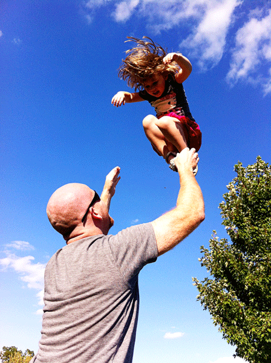

There is a markedly distinct sound that breaks from my wife Mary's lips any time she wanders around the corner to find me and the kids in a whirling dervish- it's the same sound one makes when breaching the water after a long spell underneath or if you see your coffee mug sliding off the dashboard in slo-mo. That truncated, involuntary inhale only sudden fear can coax. It's funny, her mom does the exact same thing. And my mom, too. I have seen each one of them stand by skittishly as the death-defying antics reach a fever pitch, half-laughing and unsure. On more than a few occasions they have excused themselves from the premises, the strain proving to be more than they could bear. The kids and I go on undeterred, our dance with death in full swing. There is such a stark disparity between each of our experiences in that moment- myself, the kids, and Mary- that there must be something to be learned from it. So, why rough house?

At the outset, I'll just confess that I have no idea why I am (seemingly naturally) compelled to this kind of play. Hurl them across the room onto the bed? Tickle 'em till they can barely breathe? Swing them upside-down by their ankles like a pendulum? Check. Check. Check. It would be convenient for me at this point to claim I only engage in this behavior because "the kids love it!", but that's not exactly the truth. It's definitely part of the reason that I KEEP doing it and I'd like to think I'd stop if they hated it. But, ultimately, there was a moment in time where I was holding my two-year old and something in the recesses of my brain fired off an impulse that said, "I bet it would be awesome to chuck this bundle of joy through the ether like I'm some kind of maniacal paperboy". And I did. And they loved it. And they begged for me to do it over and over again. And I did...

\[hr gap="20"\]

Maybe the answer lies somewhere in my maleness, like there's some kind of sublimated aggression hidden within the hijinx. Or maybe it's my manhood, a prescription of the social narrative that has written "rowdy" into even my affections. I don't know (and how could I, really? That's the thing about your subconscious, you know?).

Whatever the cause, it seems that nearly all of the recent research into the subject indicates that horseplay has overwhelmingly positive effects. As a teaser, some of the outcomes include:

Heightened emotional intelligence Use of restraint Turn-taking Resilience Risk-taking and risk assessment Compassion Non-violence

I won't belabor the point (because it's not what I'm after), and also because Brett and Kate McKay, the minds behind "The Art of Manliness", have already produced a fantastic article on the topic- ["The Importance of Roughhousing With Your Kids"](http://www.artofmanliness.com/2012/02/07/the-importance-of-roughhousing-with-your-kids/). I highly recommend it.

\[hr gap="20"\]

My line of inquiry, though, came from a thought I had one afternoon in the middle of a particularly raucous scrum with the munchkins. As I whipped them to and fro, into a frenzy, as I towered over them as an indomitable hulk of a thing, I thought...

"At all other time in their lives, this encounter would be unbelievably petrifying"

\[lead\]The interrelation between immense power and benevolence is nearly always skewed to the negative. \[/lead\] I mean, when's the last time you heard about a brother with a ton of money, a killer bod, good looks, and a bazooka... and he turned out to be a real peach? There's a reason that Bruce Wayne only exists in the comics. "Power corrupts, and absolute power corrupts absolutely". The narrative is commonplace- from our mistrust of Big Business to the theological grappling that surrounds the Problem of Evil- surplus strength is always suspect. Heck, we even bristle at kindness that comes on too strong- "You're being really nice to me. What are you up to"? And while there is plenty of practical wisdom in the adages and certainly a small mountain of evidence to prove it, **I can't help but think that these misgivings represent a regrettable loss of innocence and the wisdom that comes with it.** After all, some of the most sublime aspects of the human experience are wholly overwhelming....

To tremble upon being kissed... To stare, slack- jawed into the sunset and be dwarfed by the immensity of Life's own soul... To feel the presence of God... To be laid to waste by Love...

The weight of glory also crushes.

But, if we're already in half-guard, suspicious, and ready to defend whenever these massive moments pose their joyful threat, we are sure to miss out. Sure, you'll spare your heart the risk of falling from such great heights, but it may never take flight. You'll never have the wind knocked out of you... and never be left breathless.

\[lead\]We must remember again the lesson that the children teach us in their reckless glee- the lesson that we intuitively teach them with every headlock and bear hug. \[/lead\]

\[hr gap="20"\]

#### **If you liked "Rough House", please share it using one of the buttons below.  Thanks for reading!**

\[hr gap = "20"\]
