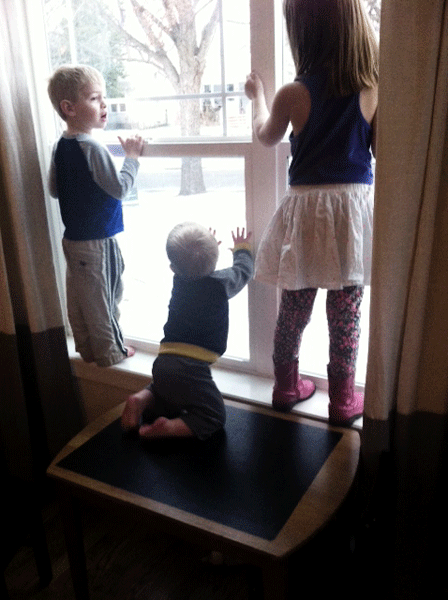

Earlier today I let one of my kids get hurt. Not negligently--I was sitting right next to Boston on the couch when the big kids came up to offer the "amazing breakfast" of wooden bread and felted vegetables they had prepared for me. As I turned my attention to celebrate this culinary coup de gras, the rascal busily let himself over the arm of the couch- in keeping with his (apparent) necessity to climb on everything. I swear the kid has sherpa blood coursing through his veins. His foot slipped, I lunged too late, and he barrel-rolled off of the side table onto the floor with a crash. A goose egg quickly appeared upon his brow as he sunk his weeping face into my chest.

\[hr gap="20"\]

\[caption id="attachment\_1136" align="aligncenter" width="448"\] Our little sherpas\[/caption\]

**Subplot:** I had been out with my friends late the night before. I had gone out in order to feel human, and I'd like to think they needed me to feel human too. But, it rendered me a little more groggy than usual and maybe a touch slower. Who's to say? If I were a dad that got up with the sunrise, having fresh squeezed juices and educational activities waiting for my children, would any of this have ever transpired?

Naturally, I spent the next two hours in a pang of immeasurable regret. And, the damnedest thing is that it wasn't **that** bad of a fall and I hadn't done anything reprehensible. **Parents are pretty good at guilt.** My mind took liberties to judge me with wild imaginations of the worst cases... soccer scholarships dissolving into thin air because of post-concussion symptoms and IQ points being exponentially diminished due to blunt force trauma.

It's easy to be hard on yourself. Many folks seem to wear it as a badge of honor. "I care too much. I work too hard. I don't give myself enough credit". But, I realized something earlier today in the midst of paying penance for a crime I didn't really commit....

\[lead\]I would not have put a single one of my friends through the ringer the way I did myself.\[/lead\]

\[hr gap="20"\]

We all know the Golden Rule. Something like this:

"Do unto others what you would have them do unto you"

... in other words, don't treat people in a way you wouldn't want to be treated.

And, we all unconsciously assume the way to violate this principle is to do just that- subject another to judgments and treatment that we wouldn't desire for ourselves. HOWEVER, there is another way to break the Golden Rule, a subtle and insidious convention but a violation nonetheless...

\[lead\]We can refuse to extend to ourselves the same graciousness, care, and understanding we so freely afford others. \[/lead\]

Being your own worst critic seems innocuous enough, but I'm not so sure anymore. Here are a few ways it might actually represent a genuine moral failure:

#### \[hr gap="20"\]

#### **1.**

We can't keep it up. Bludgeoning ourselves with undue blame on a consistent basis WILL lead to moral fatigue- a weariness in well-doing. Be it depression, resentment, or full-blown self-destruction, we will come undone at some critical point.

#### \[hr gap="20"\]

#### **2.**

It will actually KEEP US from accepting the responsibility (and accompanying righteous remorse) when we genuinely do screw up. You never take a compliment seriously when it comes from a flatterer... even if they are speaking the truth. That principle works the other way around, too.

#### \[hr gap="20"\]

#### **3.**

Isn't there an unconscious arrogance in holding ourselves to such a higher standard than the rest of our ilk? It's almost as if we're saying, "Well, it's totally understandable... **for them**. But **I** can do better". There is humility in giving yourself a break.

Stringent and strident appraisals of a soul still disparage the worth of a child, whether God's or Stan and Judy's... even if that kid is us... and we're the ones doing the judging.

But, if you find yourself guilty of this, please heed this editorial advice...

\[lead\]Don't sweat it too much and take it easy on yourself ;) \[/lead\]
