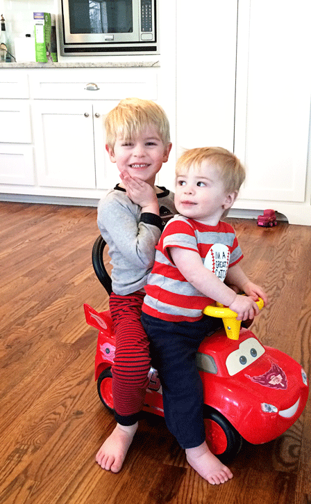

When I was pregnant with our first child, I visited a life-long friend in my hometown in Montana. During the stay, we watched a handful of “Barney” episodes with her then-two-year-old and developed inside jokes about the cheese factor of the show. It was fun- hilarious actually. After the trip, I happily returned to my Barney-free existence. Unfortunately, those days were short-lived.

Our middle son, Rocky, has a very active imagination. He is incredibly bright and his mind is constantly creating imagined worlds to play in. One of these places is the world of Barney. Much of his day is spent singing songs from the show and acting out (in great detail) every scene he has ever viewed. We cut him off from all Barney-watching well over a month ago (and have actually banished almost all tv watching in general) and the Barney obsession has not even slightly diminished. What this looks like in our home:

\[hr gap="20"\]

#### **1.** 

Rocky: “Tend you be Barney” (translation – “parent, pretend you are Barney”)

In response, Bret or I must scrunch down into a tuck position while Rocky plays innocently by. We are then to jump up and “come to life” as the big Barney with a “Ha Ha Ho! Hi Kids!” in as silly of Barney voice as we can muster. Meanwhile, Rocky (and whatever stuffed animals he has with him run to us in feigned surprise yelling, “Barney!!” This happens about 5 times a day. Except, multiply 5 by about 20 and change “day” to “hour”. At least, that’s what it feels like. When we aren’t available to act out the charade, he uses his stuffed Barney as the “Barney” (go figure) and his little people as the “kids” that run to Barney as he comes to life. He often is searching the house for “his kids” to prepare for the reenactment. \[hr gap="20"\]

\[caption id="attachment\_1143" align="aligncenter" width="448"\] I'd be Barney for these cuties any day...\[/caption\]

#### **2.** 

Rocky speaks like a cheesy kid that is way over-acting (just like the kids on Barney). His use of “gee”, “golly”, and “ah shucks” make it difficult to know if he’s just acting out a scene from Barney or if he’s really talking to us in real life. The other day, I asked Rocky if he wanted to go to the park. He exclaimed (with his pointer finger in the air) “That is a super-dee-duper idea!”\[hr gap="20"\]

#### **3.** 

**The song.** The number of times I have heard the Barney song has now probably surpassed the number of times I played Boyz to Men’s “End of the Road” when my middle school boyfriend broke up with me. And that number is very high, my friends. I remember when our oldest, Mary Grace, was little and she wanted us all to hug and kiss and stand in a circle singing “I love you, you love me” it was the sweetest thing ever. We’d hold each other and hug and kiss and follow all the directions in the song. Rocky does the same thing. With the number of times we’ve done this ending number and the sheer intensity with which Barney has set up residence in our house, I kind of want to hate the song. I really want to. It’s a terrible terrible song. But, when Rocky comes running up with a smile on his face and hope in his eyes and reaches out for our hands to complete the song ritual, it still makes me happy. It still makes me tear up and it makes me really sad for the day when he stops.
