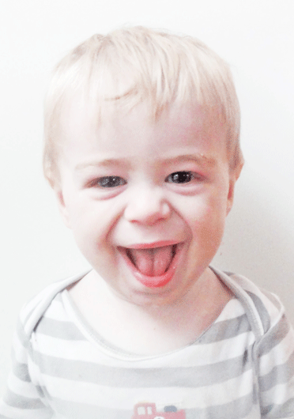
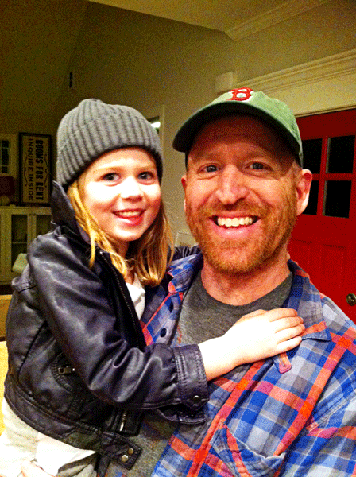

Winning a smile from a child is like unlocking a new level on your favorite video game. We coax and cajole with great fervor, just for a shot at glimpsing that toothy cavalcade hiding joy in the mouth of babes. And children, for the most part, don't need much instigating to show off their snaggles. They aren't stingy with their smiles. My son, Rocky, has a tendency to walk up to me with this half-crazed, precocious grin- always kicked sideways and usually having something to do with "poop". Mary Grace positively beams light and life into a room (except when you ask her to pose for a photo, in which case she smiles like a psych ward escapee who recently received a Botox injection). Baby Boston coos and cackles to himself heartily as he rides along in his stroller, unfazed by the fact that he sounds like a tiny, gummy, megalomaniac. And their smiles, man... they literally have the capacity to change the course of my day. They're powerful...

\[hr gap="20"\]Which gives me pause.

People don't smile at each other anymore. Not really.

Seriously, the politics of public smiling is like an unwritten rider to the Social Contract at this point.

I can't smile at females between the ages of 14-54, lest they think I'm philandering...

I can't smile at males between the ages of 14-54, because they'll think I'm just weird...

You can't smile at your co-workers because it'll look like you know something...

You can't smile at your kids' classmates' parents for the exact same reason...

You can't just smile to yourself- you'll look like a crazy person!

This effectively shrinks the demographic of appropriate candidates down to babies and folks in their 80's. \[hr gap="20"\]

I get it. We're all once-bitten and twice shy. We have all, at one point, been shattered to find a friendly flash of pearly whites to actually be an animal baring its teeth. **Or been had by the gleam and what it seemed, only to find deceit squeaking its way through the gaps.** A life's worth of bogus warranties, backhanded compliments, and phony gospels- all passing from lips with teeth clenched in that sinister way what makes a sneer of a smile.

I get it.

But, I want to smile at people again. Not strategically, like some grinning, doofus missionary bent on spreading good cheer. No--**fearlessly, without yellow**. I want to smile and be smiled upon authentically in those moments where Life affords me the audacity to be joyful to a stranger, without regard for how I may appear. I don't want to give away this grace- this most beautiful and intuitive human thing- just because it has often been co-opted into my disappointments.

\[lead\]Go ahead, cheese it up.\[/lead\]

\[hr gap = "20"\]

#### If you like "We've Forgotten How to Smile", please share it using one of the buttons below.  As always, thanks for reading.

\[hr gap="20"\]
