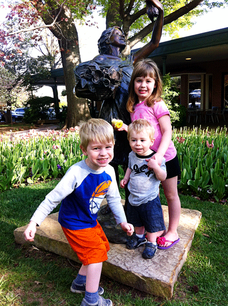

In the blog game (and I want you to know how much I hate myself for ever having penned the phrase, "the blog game") you ride a line when it comes to sharing personal stories about your kiddos. At best, it's a confessional exercise that allows other human souls a window into another real life, hopefully shattering the ubiquitous isolation that so easily creeps into our stories. At worst, it becomes a parlor trick to woo emotions or conjure feelings, no better than a prop in a reality TV show. Never have I been so aware of that tension in my writing as I am now...

\[hr gap="20"\]My middle child, Rocky, is a peculiar lad. At three-and-a-half, he is fascinated with letters. I mean, gaga. G-A-G-A. He has been since he was two. We could be taking an afternoon stroll to the coffee shop and pass by a bistro chalkboard and Rock will stop on a dime, paralyzed with intent, as he identifies (correctly) every single letter. Yesterday, he said the alphabet-**backwards.** His imagination is potent too. Overwhelmingly so, at times. He builds worlds upon worlds in which to dwell, often leading to a near incapacity to hear my beckoning or notice the edge of the kitchen table. He quickly memorizes almost any song he hears. He's terrified of the sound an industrial strength toilet makes when it flushes. Any time we're on the road together and we stop to use the facilities, he immediately starts covering his ears (this may not seem like that big of a deal, but wait until he's standing there doing his business and the guy in the next stall pushes the plunger- earmuffs, mid-stream. You get the idea.) He does this thing where he climbs, well... it's like he's trying to climb his way into your body. Not like an ape, upright and feet down. No- headfirst, upside down, tucked in and tumbling. And with abandon. He sometimes has a hard time with eye contact, which makes it hell for holiday snaps. He can spell over fifty words, but putting on a t-shirt might as well be solving a rubik’s cube for him. All of these idiosyncrasies wrapped up in a little boy who will pause ever so often during the course of the day from softly singing "Old McDonald had a "B" who got eaten by a bear, but then a BIG giant came..." while hanging his head off the side of the couch, to come to wherever I am in in the house, and throw himself into my lap with a tenderness SO raw and guileless just to say, "Dada, jou're my betts friend". \[lead\]And I am. **Proudly. \[/lead\]**

\[hr gap="20"\]

Last semester we faced a decision about whether or not to put our little guy into the 3-yr-old preschool class our daughter had attended the year before. She thrived in that environment and was well-loved by faculty and classmates alike. Given his age (he has an August birthday) and his particular disposition, we were wary about how he'd do. It was only three days a week, so we elected to go ahead and give it a whirl. In due course of time, we became more keenly aware of the intensity with which he experienced certain "inputs". If the class was doing a ditty all together, Rock might cover up and announce, "No, no. Don't sing. It's too loud for my ears." When we went to the school-wide "Trunk or Treat" event at Halloween, he didn't last three minutes. Between the dry ice machines, gorilla masks, and "Monster Mash" blaring from the PA system, he completely shorted out. He buried his soul into my own and trembled as he continually entreated, "Is dat guy gonna sclur (scare) me?" Finally, it all came to a head one day at school over the "Empty Lunchbox Incident". We were endeavoring tirelessly over the previous weeks to challenge Rocky's palate, which was hard because he is so sensitive to different textures and tastes. Fridays were pizza day for the hot lunches at school and we had decided to stop sending lunch along with Rock. Kids like pizza, right? We would remind him en route to school that he was going to have hot lunch and it had gone pretty well for a couple weeks. But, on this day (which happened to be the last day of the semester-- You know, the one with all the Christmas cheer and parties?), on this day I forgot to take the empty lunchbox out of his backpack. To give a little perspective, we had asked him almost every day that semester what his favorite thing about the day was... and every day, without fail, he had said "I open my wunchbox!". As all the children sat down for lunch and began unpacking no doubt what was a smorgasbord of Yuletide treats, our little man came to the crushing realization that, this time, there was no Pirate's Booty in his Jake lunchbox. In fact, there was booty at all. He broke down. The teacher tried to give him pizza. He slapped her in the face...

I have since imagined what it must have felt like for him. The excitement and expectation of opening his lunchbox, coupled with that monstrous imagination of his. I can feel the weight of disappointment and panic rising up in him, his private narrative having been derailed by a hollow treasure chest. I can imagine the teacher following her training- getting down on his level, presenting the pizza to his eyes, her face inching closer, her presence crowding in on his own, her voice growing louder in his ears. Sight, smell, taste, touch, sound... **snap**.

\[hr gap="20"\]

Rock has a condition known as "[sensory processing disorder"](http://www.spdfoundation.net/). We didn't know it until recently, but it sure explains a lot of things. It's odd how comforting it is just to know you're not alone. We pulled Rocky out of the traditional preschool setting and have begun to devote our time and resources toward learning more about SPD. Thanks to a very gracious couple who heard about Rock's situation and were vulnerable about their own daughter's struggles with the same plight, we found the good folks at [Imagine Pediatric Therapy](http://www.imaginepediatrictherapy.com/) in Owasso, Oklahoma-- just a short drive outside of our home in Tulsa. I remember the first day we went for his evaluation. As the therapist went down the list of typical symptoms and behaviors: "Yep, that's Rock. Yea, that one too. Man, it's like they wrote the book just about him!" Again, we felt the simple but profound consolation that comes with understanding. Mary and I cried together in the office as the therapist played alongside Rock, the knowing confidence that shone in her face filling our hearts with joy, our minds with peace. \[hr gap="20"\]

Our oldest, Mary Grace, is the type of kid that everyone immediately loves. She is outgoing, smart, sweet, and precocious beyond measure. She is **easily** appreciated by the outside world.\[lead\]It is a difficult thing, however, to have a kid whose genius is hidden. \[/lead\]Having Rocky sometimes feels like having Michigan J. Frog for a son– you know, the frog in a top hat from the Merrie Melodies that would sing “Hello My Baby” and perform vaudeville-style dances, but would only perform for that **one** guy? Rocky is like that sometimes, like a favorite song or beloved memory that’s meaning is impossible to convey to someone else.

Maybe you have one of these kids – the ones with the hidden genius…

A kid who dances, twirls, and won’t STOP talking around the house, but becomes painfully silent and withdrawn around anyone but family…

A kid whose physical disability draws odd looks instead of friendly introductions at the park…

A kid who just **can’t** connect with others…

\[lead\]No one in the entire world of public spaces may know the fantastically complex soul and the depth of pure genius that lay inside of my son Rocky. \[/lead\]But I do. And that's a hard thing sometimes. But, it also carries with it a huge responsibility – to love him, appreciate him, and make him **feel it** every day.

\[hr gap="20"\]

Over the course of the last ten weeks, we have been in occupational therapy at Imagine. We call it "Rocky's school". He absolutely loves it. The staff of therapists there have been exceedingly kind and patient with Rock (and even more so with us- we ask a lot of questions). I am thrilled to say that he is making progress by leaps and bounds. From motor planning skills like putting on his own clothes, to fine motor skills like handling scissors, to muscle development in his grip strength and core- the Rocket is on the rise. More than anything, the camaraderie and encouragement that has come from seeing a group of people greet him with such welcome.\[lead\] Our little secret is getting out.\[/lead\]

\[hr gap="20"\]

A few acknowledgements:

I'd like to thank Nana for always having such a soft spot for Rock. I think you understand him better than anyone else in the world. You have often inspired me to love him better.

I'd like to thank my good friend, Bob, for seeing the "Charles Wallace" in my son, even on the days when I couldn’t. I'll never forget reading "[Wrinkle](<a%20href="http://www.amazon.com/gp/product/0312373511/ref=as_li_tl?ie=UTF8&camp=1789&creative=9325&creativeASIN=0312373511&linkCode=as2&tag=thdais-20&linkId=7MJG2A65CK3MU5GX">The Wrinkle in Time Quintet Boxed Set (A Wrinkle in Time, A Wind in the Door, A Swiftly Tilting Planet, Many Waters, An Acceptable Time)</a>)" and learning how right you were.

Finally, I'd like to thank the aforementioned people at [Imagine Pediatric Therapy](http://www.imaginepediatrictherapy.com/). Your efforts with our son are making a significant impact in his life and our home.

\[hr gap="20"\]

#### If you have one of these hidden geniuses in your life, we'd love to hear about them.  Also, please consider sharing this post using one of the buttons below-we'd love to reach others that may be experiencing the same issues. \[hr gap="20"\]

SPD takes many forms- this post only speaks to what it looks like in our son. Next week, we'll share additional resources that have helped tremendously over the past few months- as well as some of the therapies and products that are working for us.

\[hr gap="20"\]
