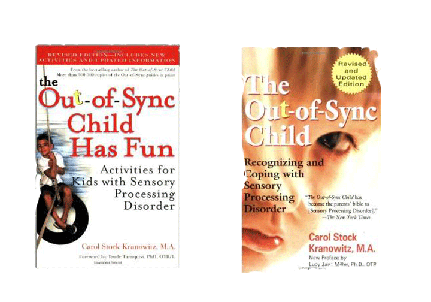
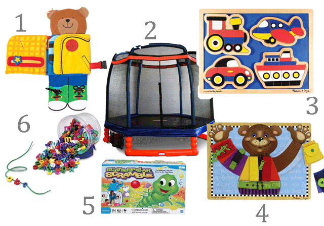

In last week's [post](http://www.thedadissues.com/having-a-child-who-is-different-our-sensory-processing-disorder-spd-story/ "Having a Child Who is “Different” – Our Sensory Processing Disorder (SPD) Story"), Bret wrote about our son, Rocky, and his Sensory Processing Disorder (SPD). Because early intervention is key, we are so very thankful for the parents of Rocky's classmate who were bold enough and caring enough to suggest that he may benefit from treatment and that we should look into SPD. That had to be hard for them--and awkward to bring up... So, if you are a parent or have children in your lives, take a moment and get familiar with the [symptoms checklist](http://www.spdfoundation.net/about-sensory-processing-disorder/symptoms/). It is amazing how many variations the disorder takes. For Rocky, some symptoms fit so perfectly and others aren't him at all. When Rock was a baby (maybe just a year old), Bret and I would often comment to each other how tough Rocky is--he seemed oblivious to pain. When I look at the symptoms list, **THAT** is a symptom! On its own--probably nothing, but with all the other things that presented in the time between 1- and 3-years-old, we could have known (and sought treatment) much sooner.

\[hr gap="20"\]

But, that's the past and our boy is well on his way to learning how to cope. We wanted to share a few of the things that are helping us learn more and helping Rocky with his development. Here goes:

These books: [The Out Of Sync Child](http://www.amazon.com/gp/product/0399531653/ref=as_li_tl?ie=UTF8&camp=1789&creative=9325&creativeASIN=0399531653&linkCode=as2&tag=thdais-20&linkId=DZR6ICOCDCYT4FRK">The Out-of-Sync Child</a>) and [The Out of Sync Child Has Fun](http://www.amazon.com/gp/product/0399532714/ref=as_li_tl?ie=UTF8&camp=1789&creative=9325&creativeASIN=0399532714&linkCode=as2&tag=thdais-20&linkId=ORCCW5GFRHCOA4VJ">The%20Out-of-Sync Child Has Fun, Revised Edition: Activities for Kids with Sensory Processing Disorder</a>) were given to me by a friend at work. I have since been devouring them. The Out Of Sync Child is full of resources and the "Has Fun" one is full of activities that are great for kids with SPD--although, really--they are fun for all kids. When we're on our 4th round of hide-and-seek for the day, I welcome some new ideas...

Most of Rock's delays are with motor skills and motor planning. There are free things we can do for this--we do a lot of bear crawls and bunny hops and pushups against the wall. We do crab walks and wheelbarrows, and... it really feels like I should add a "bag race" in here, but that would be lying...We haven't done a bag race yet. Although, that's actually a great idea. We color and paint and attempt to use scissors. Along with all of this, there are products that are helping too. I'm pretty convinced that Melissa and Doug are the patron saints of SPD, so basically any Melissa & Doug toy has some benefit, I'm sure... But in the immortal words of Maria von Trapp, these are a few of my favorite things.

\[lead\]1. [Dress-Up Bear](http://www.amazon.com/gp/product/B00P4CF5AO/ref=as_li_tl?ie=UTF8&camp=1789&creative=9325&creativeASIN=B00P4CF5AO&linkCode=as2&tag=thdais-20&linkId=45BRJS3IZXC6QHAA">Melissa & Doug Dress Up Bear</a>)// 2. [Little Tikes Trampoline](http://www.amazon.com/gp/product/B004RSGA6O/ref=as_li_tl?ie=UTF8&camp=1789&creative=390957&creativeASIN=B004RSGA6O&linkCode=as2&tag=thdais-20&linkId=A7UB6GAS3XBBKZLR">Little Tikes 7' Trampoline</a>)//3. [Things That Go Puzzle](http://www.amazon.com/gp/product/B000GKU3K6/ref=as_li_tl?ie=UTF8&camp=1789&creative=9325&creativeASIN=B000GKU3K6&linkCode=as2&tag=thdais-20&linkId=CKCMEZ5TV6DKLUUI">Melissa & Doug Things That Go - Shaped</a>)//4. [Basic Skills Board](http://www.amazon.com/gp/product/B000NVBE10/ref=as_li_tl?ie=UTF8&camp=1789&creative=9325&creativeASIN=B000NVBE10&linkCode=as2&tag=thdais-20&linkId=37J7WH5IKZPIZTPM">Melissa & Doug Basic Skills Board</a>)//5. [Scatterpillar Scramble](http://www.amazon.com/gp/product/B001R6ATZW/ref=as_li_tl?ie=UTF8&camp=1789&creative=9325&creativeASIN=B001R6ATZW&linkCode=as2&tag=thdais-20&linkId=FRH3RXWQV7MKRXJH">Hasbro Scatterpillar Scramble</a>)//6. [Lacing Letters](http://www.amazon.com/gp/product/B000MWRM8Y/ref=as_li_tl?ie=UTF8&camp=1789&creative=9325&creativeASIN=B000MWRM8Y&linkCode=as2&tag=thdais-20&linkId=RMRLDNM7WITNTWFZ">Learning Resources Lacing Lowercase Alphabet</a>)\[/lead\]

The trampoline provides hours of entertainment for **all** the kids and it can also double as a glorified play pen for our 18-month-old, Boston. Rocky's confidence grows by leaps and bounds (see what I did there?) every time he learns a new "trick". The shape puzzle was a revelation for me. Rock can do the most intricate puzzles if he's on the iPad. But, once you switch to something in 3-D, he's lost. The peg puzzles are too easy and real puzzles are too hard. This is the perfect in-between. I had never even seen these in stores before he used them at [occupational therapy](http://www.imaginepediatrictherapy.com/). It is the right amount of challenge for him. The skills board has some pieces that are perfect for him and a couple that are too hard for this age (tying a bow), but our just-turned-5 daughter learned to tie her shoes on this over one long road trip. Scatterpillar scramble is awesome. You use pinchers to move balls onto the caterpillar's hands while he dances around. For Rocky, we turn off the dancing. However, Bret and I had an epic board-game battle with this and the princess matching game the other night after the kids went to bed. I beat him soundly at Scatterpillar Scramble. We won't talk about the matching game though. Lacing letters are right up Rock's alley since they're letters, but they challenge his fine motor skills so well.

So, those are a few of our favorites. We are always looking for new challenges for Rocky, so please tell us about any toys/games/activities/resources you recommend.

\[hr gap="20"\]

Also, we are so grateful to readers who wrote to us with their own stories after the post last week. One person said "This just made me feel so much less alone." For Bret, there is no other reason for writing than that. Parenting can be so isolating--particularly if things aren't going according to "plan". We also appreciate so many that wrote in with their stories of hope - stories of kids for whom treatment worked swimmingly with no residual effects. Thank you- you brought us to tears and helped **us** feel less alone.
