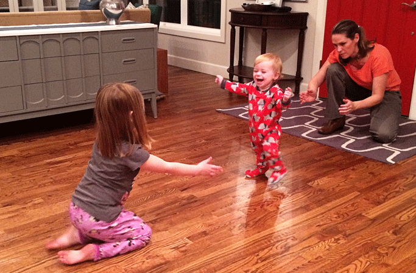

Time has a way of teaching you lessons whenever you start to hurry its flow along- like the college junior who can't wait for school to be over and "real life" to begin. We don't always know what we actually want. It seems sometimes like we're the last to know. Parenting is no exception. I can remember holding my newborns in my arms- those rumpled, quasi-conscious larvae- and thinking, "You're gonna be so much fun... one day." Now, walk and talk and do us a trick! I had no idea what I was asking for. And, keep in mind, I have done this three separate times in fairly rapid succession. I'm a real quick study...

\[hr gap="20"\]

Toddlerhood is like the fool's gold of childhood development. It is a wondrous time where all of the apparent strides (perhaps including literal ones) your child has made over the last nine months turn out to make your life far more difficult. Let's take something simple like, say, mobility. Before, "babyproofing" simply meant placing your swaddled infant on the couch, gently tucking a throw pillow on the outside edge, and then walking away with complete confidence that baby will be in the EXACT same position when you get back. For toddlerhood, the appropriate steps for "babyproofing" are as follows: first, check to see if your house has more than one level. If so, move out of that house into new, suitable living quarters. Next, remove ALL furniture. Preferably, find an unoccupied sanitarium and take up a dwelling there- they've already done the necessary wall padding.

\[caption id="" align="alignnone" width="683"\] Judging by her expression, maybe my wife Mary recognized the impending doom of this "milestone."\[/caption\]

\[hr gap="20"\]

Simply put, children between the ages of 9-18 months are on a mission to off themselves. Danger is the drug of choice, well before self-preservation has entered their tiny minds as a motivation. All other pharmaceuticals have to be tinged with artificial flavors like bubble gum or sour cherry, but danger is willingly consumed in paper, plastic, and stainless steel. The newfound powers you expected to contribute to their livelihood are wholly devoted to effecting their demise. If I had a nickel for every time I have lunged to snatch one of my brood by the ankles from the yawning jaws of death, then I'd have just as many nickels as I've pulled from their inquisitive gullets over the years. My 3rd child, Boston, is especially foolhardy. I swear to God it's like living with the "Downhearted Duck" from Tom and Jerry. You know, the malcontent Mallard who spends the episode trying to feed himself to Tom while Jerry scrambles to thwart his every attempt. Yea, it's like that some days. Or maybe a game of Spy vs Spy, but one of them has a death wish and the other one is their father.

I don't really know why I'm writing about this. It's something that all parents go through, I suppose, and maybe I'm just commiserating. But there is one thought that haunts me somewhat. If **I** were to die tomorrow-be it an automobile accident or a toy car on the staircase- my toddler would have **no recollection, no idea** of the immense vigilance with which they were cared for during these witching hours. He would not know the hand that drew the line between life and death, for him. It is a deeply painful thought, in a way. But, perhaps, it is fitting. \[lead\]To give life to those who have not requested it; to enrich life for those who have not the capacity to tell the difference. That seems like it might be Love..\[/lead\]

\[hr gap="20"\]

##### Thanks for reading.  If you enjoyed 'Cheating Death in A Onesie," please consider sharing it using one of the buttons below.

\[hr gap="20"\]
