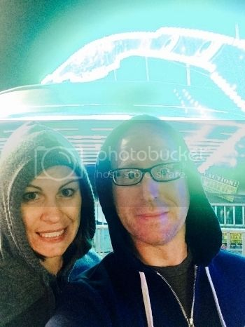

"You know what we should do? We should ride a ride!"

Mary and I made our annual pilgrimage to the Tulsa State Fair this past Sunday night. Although just a few miles away, it is worthy of the name "pilgrimage" due to the absolute surreal nature of its inhabitants and the moral distance we travel in terms of gluttony. If calories were able to be represented spatially, it might as well be light years. We eat like it's last call at the temple of Bacchus. In the inaugural year of this little ritual, we went on a two-day bender where we made a sport of consuming as many different foodstuffs as possible. It cost us over $200, half that in assorted remedies, and most of our dignity. On the bright side, we did have a great time. And, we now own a minority stake in Alka Seltzer. \[hr gap="20"\]

Back to Sunday. It was a beautiful, early autumn evening in T-Town, with just enough snap in the air to warrant a hoodie and standing a little closer. We walked arm in arm, lazily snacking our way through the fair. Somewhere along the way- I think it was around the deep-fried cheese curds- Mary realized that this year's visit represented the 10th anniversary of "Fair Food Night." And this, to her then-lipid-soaked brain, demanded commemoration.

"You know what we should do? We should ride a ride!"

It was a charming thought, actually- a random act of youthfulness to signify "we still had it" and a way to turn back the clock to a simpler time. We immediately began to reminisce about our favorite attractions from childhood. Mary insisted that "Ms. Tractor Pull" did not count (but why did I feel such a combo of exhilaration and dizziness, then?). Her favorite was the Zipper, but, thankfully, the line was way too long. We settled on the "Gravitron" --that gravity-defying, flying saucer we had both been fond of as kids. Mary was giddy as she ran to fetch the tickets, while I went ahead and took our spot in line. \[hr gap="20"\]

\[caption id="" align="aligncenter" width="350"\] These people are about to make a huge mistake\[/caption\]

What transpired over the next three minutes was hysterical, as we corporately fast-forwarded through the five stages of grief even BEFORE our demise had befallen us:

"This is gonna be awesome!" "We can still do this, right?" "This is a huge mistake." "Oh God, I forgot about my claustrophobia..."

As the door closed and the ride attendant took his place in the spinning DJ booth at the center of the room, he let out one of those hype-building "Are ya'll ready for this?!". No. No, MC Vertigo, we are most definitely not ready for this. The first thing that happened was my cell phone flew out of my pocket. Unfortunately, the G-force had already pinned my head to the wall so there was no way to look for it. And then we shared a laugh. But it was one of those nervous laughs where you're pretty sure you're gonna die soon. As the speed increased we fell silent- partly because of fear, partly because our faces were being pushed into the back of our heads. I don't know about Mary, but I was quietly going through the same mental exercises I do when things get rough in the dentist chair. Finally, it was over. The guy fished my phone out of the machine's undercarriage and we gingerly exited the merry-go-round from hell. \[hr gap="20"\]

The aftermath was immediate. Gone was the romance and our spritely cadence. Gone was our meandering conversation and easy laughter. In lieu of that we made our trek back to the car in hangdog posture, exchanging belches and sentiments of regret. Mary spent the car ride home googling possible correlations between disequilibrium and the early onset of a stroke.

\[lead\]The Gravitron is NOT a time machine.\[/lead\]

\[hr gap="20"\]Do you have any post-parenting, "return-to-youth" moments gone awry? We'd love to hear them in the comments below.\[hr gap="20"\]

#### If you liked this article, please consider sharing it using one of the buttons below.  \[hr gap="20"\]
