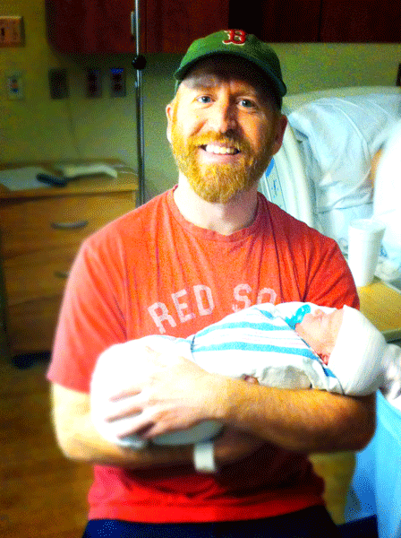

Every name has a story.

Baseball has always held a special significance for Mary and me, especially when we get to attend a live game together. There’s something about the pageantry of the whole enterprise- the concessions, the suds, belting out “Take Me Out To The Ballgame” at the 7th inning stretch, and booing the ump on a bad call- that is intoxicating. We give ourselves over to it entirely. In that surrender to the grand affair of America’s pastime, we are returned to our younger love and for those nine innings, I think, reminded of a time where affections are all excess and reckless- the kinds that don't blink at paying $20 for a bag of hot peanuts if it completes the ambiance just perfectly. It is pure romance.

It’s World Series time right now. Two nights ago, the Kansas City Royals whipped the New York Mets 7-1 to take a 2-0 game lead. Two **years** ago, though, the Fall Classic was being held at Fenway Park- home to our beloved Boston Red Sox. And, Mary was pregnant. Uber pregnant. As the weeks rolled along and nesting came into full swing, the baseball Playoffs had also begun their annual showcase. Each night at the Spears house, we settled in to watch and wait. The Cardinals beat the Pirates and then the Dodgers. The Sox took out the Rays and the Tigers. With every game our anticipation rose and the due date inched closer, until it became an object in the rear-view (she was over-due). The final matchup was set and the World Series began. It had been nine months since pitchers and catchers reported to spring training, nine months since we found out our team would be adding a free agent of its own…. \[lead\]both stories poised to culminate in their final act sometime during the week.\[/lead\]\[hr gap="20"\]

For this pregnancy, Mary had decided early that she wanted to do it au naturale. We employed the services of our good friend, Rachel, who was training as a doula. On Wednesday morning, October 30th, we called her over to the house to spend the day in labor with us. She was incredible. She walked Mary through breathing and relaxation exercises, surrounded her with the comfort of soothing smells and sounds. Our eldest son, Rocky, rubbed his mama’s back as she worked through the wearying pangs of early labor. It was a true group effort and it was lovely. Around six o’clock in the evening we decided to head to the hospital. Things were getting serious.

Mary was already to 6cm by the time the nurse was able to check her out. Rachel and I set to doing everything we could to keep her comfortable. We rode out contractions together with me holding her up, standing in a “chair” position with my back pressed hard against the wall. After a particularly intense minute had passed, Mary glanced at the clock and said to me, out of breath, “It’s seven o’clock. Turn the game on.” Rarely have I been more proud to be her husband than when she uttered these words. Oh yea! The game! I had almost forgotten. The Red Sox were carrying a 3-2 series lead back to Boston, with a chance to clinch a championship at Fenway Park for the first time in 95 years. The TV was clicked on and the familiar sounds of October baseball filled the room.\[hr gap="20"\]

Around the bottom of the 3rd inning, heavy labor had fully commenced. Mary found a comfortable posture on her knees, with her head and hands lying over some pillows on the couch. She buried her face into them and clinched tight while wave after wave passed through her body. I, much like our two-year old had done earlier in the day, sat beside her and rubbed her back. It’s hard to know what to do or say in moments like that, moments where you just want the pain to be over for someone you love. So, I thought of the best news I could give her, something that was sure to bolster her spirits. As she shuddered and groaned, face-down, I leaned in close and whispered: “Honey, I know you can’t see the TV right now, but Shane Victorino just smashed a 3-run triple off the Green Monster to put the Red Sox up.” Without saying a word or bringing her eyes to meet mine, she simply raised her left hand aloft and shook her fist with a hearty thumbs up. \[lead\]It was all over but the cryin’.\[/lead\]

Our son was born within fifteen minutes of the time they hung that “3” on the scoreboard. It was almost as if the cosmos recognized that one couldn’t happen until the other. Delivery accelerated so quickly from that point Mary actually had to “hold him in” for a couple minutes and a surgical tech we found in the hallway ultimately delivered the child. Mary was an absolute soldier- a courageous, radiant soldier. Our room quickly filled with laughter and lightness and gobs and gobs of nurses, most of whom were taking advantage of ours being the only room in the delivery wing that was featuring the big game. The doctor even showed up. He tended to Mary as she watched the Red Sox tack on another three runs in the bottom of the 4th to take a 6-0 lead, a lead they would never relent. For the final three innings of the game I sat by her bed with the new baby boy in my arms (and a Cheshire grin irresistibly painted across my face), and we reveled in the moment together as friends and family showed up to welcome the lad. It was nothing short of sublime.\[hr gap="20"\]

Two days later, **after much deliberation**, we finally decided on a name and made it “Facebook official” with the following post:

> _“We lived and died with the Red Sox while we waited for our baby boy to come. The sounds of Game 6 filled our hospital room along with the sounds of his first cries on Wednesday night as the Sox clinched the Series. **This name chose him: Boston Marshall Spears.**”_

\[hr gap="20"\]\[lead\]Happy 2nd birthday, my little man.\[/lead\]

#### \[hr gap="20"\] If you liked "A Boy Named Boston", please consider sharing it using one of the buttons below.\[hr gap="20"\]
