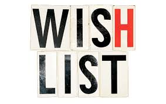

Mary and I were commiserating the other night and found ourselves daydreaming about our Christmas lists. Here's what we came up with. \[hr gap="20"\]

#### 1.

Alcohol \[hr gap="20"\]

#### 2.

To spend an entire 24-hour period without having to wipe or in any way lay eyes on someone else's b-hole. \[hr gap="20"\]

#### 3.

A time machine. In theory, this would be used for noble purposes or educational pursuits, like zapping yourself back to spend a day ruminating in the Parisian salons or getting the drop on the _creator of Calliou_ Hitler. In actuality, it would constantly be utilized to whisk us back to those now-inconceivable, glorious, childfree Saturday mornings. (On a side note, young parents in possession of a time machine has got to be the greatest premise for a moral drama I've ever heard of.) \[hr gap="20\]

#### 4.

**Her:** To be able to sneeze, cough, laugh, or jump on a trampoline without ever-so-slightly peeing my pants.\[hr gap="20"\]

#### 5.

**Him:** My (pre-child) free testosterone levels. \[hr gap="20"\]

#### 6.

**Her:** See above.\[hr gap="20"\]

#### 7.

To be able to pop a soda tab or unwrap a piece of candy without having a band of rugrats charge at me like hogs just called to slop. \[hr gap="20"\]

#### 8.

A superpower that guarantees I strike the perfect balance between giving my children everything I've got and maintaining a Self that's got anything worth giving. Or, if that's off the table, the ability to conjure a babysitter at a moment's notice. \[hr gap="20"\]

#### 9.

A personal photographer. I don't want to watch their childhood pass through the face of a phone; I don't want to be empty-handed, without relic or record, when they're grown. Also, it'd be nice to actually be in some of the photos.\[hr gap="20"\]

#### 10.

World peace. No, I'm so fucking serious about this, especially this year. I'm sick of the senseless suffering. I'm sick of the politicking of human tragedy. I'm sick of my own complacency and cynicism in the face of it all. And, even though the inclusion of this wish has all the intellectual complexity of Amy Grant's _Grown Up Christmas Wish__,_ I do wish it. Let there be peace on earth, at least for the kids. \[hr gap="20"\]

#### 11.

A Roomba that's able to navigate the interior contours of an SUV. We could call it a "Caroomba". Ay, Caroomba! \[hr gap="20"\]

#### 12.

**Her:** An entire yoga class devoted wholly to the final relaxation (shavasana) pose. So, basically, a guided nap. \[hr gap="20"\]

#### 13.

**Him:** A device that's able to quantify the caloric expenditure of giving piggy-back rides, carrying sleeping children upstairs, and the general wrangling that goes on in a day. Something like a Fitbit. A "Totbot"? \[hr gap="20"\]

#### 14.

A lifetime enrollment in an _Elf On The Shelf_ relocation services program. \[hr gap="20"\]

#### 15.

An external memory where could be stored all the tiny moments of this strange parade upon which we are embarked. I fear I cannot keep it all; as new memories come, some others can't help but be made dim. I've already forgotten that funny thing Rocky used to say from _Winnie The Pooh_. And, when was the moment when Boston first smiled that soul-shattering, toothless grin at me? Was it a Tuesday? \[hr gap="20"\]

#### 16.

Did I say alcohol already? If not, alcohol. \[hr gap="20"\]

\[lead\] What's on your list this year? Leave it in the comments! \[/lead\]\[hr gap="20"\]

#### If you liked _The Honest Parent's Christmas Wish List_, share it using one of the buttons below.

